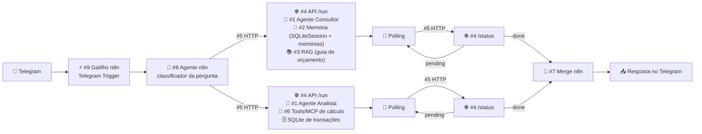

# TP2 — Ferramentas, Raciocínio Encadeado, Memória e Avaliação — Implementation Plan

> **For agentic workers:** REQUIRED SUB-SKILL: Use superpowers:subagent-driven-development (recommended) or superpowers:executing-plans to implement this plan task-by-task. Steps use checkbox (`- [ ]`) syntax for tracking.

**Goal:** Evoluir o agente de finanças do TP1 para um protótipo com tools de cálculo sobre SQLite, cadeia de prompts least-to-most, memória (SQLiteSession + RAG com embeddings), saídas Pydantic e avaliação A/B + PRRR.

**Architecture:** Três comandos CLI (`importar`, `perguntar`, `diagnosticar`) orquestram agentes especializados por código. Toda aritmética é Python determinístico em `agent/database.py`, exposto ao LLM por `@function_tool` finas em `agent/tools.py`. O RAG guarda embeddings (Google AI Studio) como JSON no mesmo SQLite e busca por cosseno em Python puro.

**Tech Stack:** Python 3.12, `openai-agents` 0.21.1 (`Agent`, `Runner`, `SQLiteSession`, `function_tool`, `AgentOutputSchema`), Pydantic 2, `sqlite3`/`csv`/`statistics` da stdlib, `pytest` (dev), OpenRouter + Google AI Studio (endpoint compatível com OpenAI).

**Spec:** `docs/superpowers/specs/2026-10-02-tp2-design.md`

## Global Constraints

- Código limpo, nomes claros em português (padrão do TP1), **sem comentários** no código; docstrings só nas `@function_tool` (viram a descrição da tool para o LLM).
- O LLM nunca calcula: todo número que aparece em uma resposta vem de uma função de `agent/database.py`.
- Categorias fixas, exatamente: `Alimentação`, `Transporte`, `Moradia`, `Saúde`, `Educação`, `Lazer`, `Compras`, `Serviços/Assinaturas`, `Não identificado`.
- Saídas de agentes sempre via `output_type=AgentOutputSchema(<Modelo>, strict_json_schema=False)` (como no TP1, compatível com Gemma).
- Mês sempre no formato `AAAA-MM`; valores arredondados a 2 casas no código.
- Toda execução de comando gera log `.md` em `prompts/outputs/` (ou no diretório de logs da avaliação).
- Sem dependências de runtime novas; `pytest` só como dependência de desenvolvimento.
- Nunca commitar `.env` nem `data/`; `.env.example` só com nomes de variáveis.
- Commits terminam com `Co-Authored-By: Claude Opus 5.5 <noreply@anthropic.com>`.
- Rodar comandos com o venv: `.venv/bin/python`, `.venv/bin/pytest`.

## Review Focus

- CSV com BOM, cabeçalho `descricao` sem acento, coluna obrigatória ausente ou valor não numérico → importação deve funcionar ou falhar com mensagem citando a linha, nunca gravar lixo (testes na Task 3).
- Duas transações idênticas legítimas no mesmo CSV → as duas gravadas; reimportar o mesmo CSV → nada duplicado (teste na Task 3).
- Pergunta sobre mês sem dados ou mês em formato inválido → a tool devolve ao LLM um aviso com os meses disponíveis em vez de zeros silenciosos (teste na Task 8).
- Classificador que omite, duplica ou inventa ids → ids inventados descartados, duplicados deduplicados, omitidos reenviados uma vez e depois gravados como `Não identificado` (teste na Task 9).
- Falha de provedor no meio de um run com sessão → o histórico da sessão não fica com a pergunta duplicada ao tentar o próximo provedor (teste na Task 7).

---

### Task 1: Configuração, dependências de dev e verificação do modelo com tools

**Files:**
- Modify: `agent/config.py`
- Modify: `.env.example`
- Modify: `.gitignore`
- Modify: `pyproject.toml`
- Create (scratchpad, não commitado): `$SCRATCH/spike_tools.py`

**Interfaces:**
- Produces: `Settings.google_embedding_model: str`, `Settings.google_extra_models: tuple[str, ...]`

- [ ] **Step 1: Acrescentar pytest como dependência de desenvolvimento e configurar o pythonpath**

Em `pyproject.toml`, acrescentar ao final:

```toml
[dependency-groups]
dev = ["pytest>=8.3"]

[tool.pytest.ini_options]
pythonpath = ["."]
testpaths = ["tests"]
```

Run: `uv sync` (ou `.venv/bin/pip install "pytest>=8.3"` se `uv` não estiver disponível)
Expected: pytest instalado; `.venv/bin/pytest --version` imprime a versão.

- [ ] **Step 2: Ignorar o banco local**

Em `.gitignore`, acrescentar:

```gitignore

# Banco local do agente (transações, sessões, memórias)
data/
```

- [ ] **Step 3: Estender Settings com modelo de embedding e modelos Gemini extras**

Em `agent/config.py`, acrescentar a constante e os campos:

```python
GOOGLE_EMBEDDING_MODEL_PADRAO = "gemini-embedding-001"
```

No dataclass `Settings`, após `google_base_url: str`:

```python
    google_embedding_model: str
    google_extra_models: tuple[str, ...]
```

Em `load_settings()`, no `return Settings(...)`, após `google_base_url=...`:

```python
        google_embedding_model=os.getenv("GOOGLE_EMBEDDING_MODEL", "").strip() or GOOGLE_EMBEDDING_MODEL_PADRAO,
        google_extra_models=tuple(
            modelo.strip() for modelo in os.getenv("GOOGLE_EXTRA_MODELS", "").split(",") if modelo.strip()
        ),
```

Em `.env.example`, após `GOOGLE_BASE_URL=...`:

```
GOOGLE_EMBEDDING_MODEL=gemini-embedding-001
GOOGLE_EXTRA_MODELS=
```

- [ ] **Step 4: Escrever o script de verificação (scratchpad)**

`$SCRATCH` é o diretório de scratchpad da sessão. Conteúdo de `$SCRATCH/spike_tools.py`:

```python
import asyncio
import sys
from pathlib import Path

from agents import Agent, AgentOutputSchema, OpenAIChatCompletionsModel, Runner, SQLiteSession, function_tool
from pydantic import BaseModel

sys.path.insert(0, ".")
from agent.config import configure_sdk, google_client, load_settings, modelo_no_google, openrouter_client


class Saida(BaseModel):
    resposta: str
    valor: float


@function_tool
def somar(a: float, b: float, rotulo: str | None = None) -> str:
    """Soma dois números.

    Args:
        a: Primeira parcela.
        b: Segunda parcela.
        rotulo: Rótulo opcional do cálculo.
    """
    return str(round(a + b, 2))


async def testar(provedor, client, modelo, banco):
    agente = Agent(
        name="spike",
        instructions="Use sempre a ferramenta somar para qualquer conta. Responda em JSON.",
        model=OpenAIChatCompletionsModel(model=modelo, openai_client=client),
        tools=[somar],
        output_type=AgentOutputSchema(Saida, strict_json_schema=False),
    )
    sessao = SQLiteSession(f"spike-{modelo}", banco)
    try:
        primeiro = await Runner.run(agente, "Quanto é 1234.5 + 98.25?", session=sessao)
        segundo = await Runner.run(agente, "Some 10 ao resultado anterior.", session=sessao)
    except Exception as erro:
        print(f"FALHA {provedor} {modelo}: {type(erro).__name__}: {str(erro)[:300]}")
        return
    itens = [(i.type, getattr(i, "tool_name", None), getattr(i, "call_id", None)) for i in primeiro.new_items]
    print(f"OK {provedor} {modelo}: {primeiro.final_output!r} -> {segundo.final_output!r}")
    print(f"   itens: {itens}")
    saidas = [i.output for i in primeiro.new_items if i.type == "tool_call_output_item"]
    argumentos = [getattr(i.raw_item, "arguments", None) for i in primeiro.new_items if i.type == "tool_call_item"]
    print(f"   argumentos: {argumentos} saidas: {saidas}")


async def main():
    settings = load_settings()
    configure_sdk(settings)
    banco = Path(sys.argv[1])
    _, cliente_openrouter = openrouter_client(settings, 0)
    for modelo in settings.modelos:
        await testar("OpenRouter", cliente_openrouter, modelo, banco)
    if settings.google_api_key:
        cliente_google = google_client(settings)
        for modelo in [modelo_no_google(m) for m in settings.modelos] + ["gemini-2.5-flash"]:
            await testar("Google", cliente_google, modelo, banco)
        resposta = await cliente_google.embeddings.create(model=settings.google_embedding_model, input=["teste", "outro"])
        print(f"embeddings: {len(resposta.data)} vetores de dimensão {len(resposta.data[0].embedding)}")


asyncio.run(main())
```

- [ ] **Step 5: Rodar a verificação**

Run: `.venv/bin/python $SCRATCH/spike_tools.py $SCRATCH/spike.db`
Expected: uma linha `OK`/`FALHA` por provedor×modelo, os itens de cada run (`tool_call_item`, `tool_call_output_item`, `message_output_item`), os argumentos e saídas da tool e uma linha `embeddings: 2 vetores de dimensão N`.

Interpretar:
- Se `tool_name`, `call_id`, `raw_item.arguments` e `output` aparecem preenchidos, o desenho de `agent/rastreio.py` (Task 6) vale como está. Se `arguments` vier `None`, ajustar a Task 6 para ler `item.raw_item["arguments"]`.
- Se o segundo run respondeu ~1342.75 (usou o resultado anterior), o `SQLiteSession` funciona com `chat_completions`.
- Se os modelos Gemma falharem com tools e algum Gemini funcionar, colocar esse modelo em `GOOGLE_EXTRA_MODELS` no `.env` local (ex.: `GOOGLE_EXTRA_MODELS=gemini-2.5-flash`).
- Se o embedding falhar, parar e reportar ao usuário (o RAG depende disso).

Registrar o resultado (o que funcionou e o que falhou) em uma nota curta para o relatório final: `$SCRATCH/spike_resultado.md`.

- [ ] **Step 6: Rodar os testes (nenhum ainda) e o import do config**

Run: `.venv/bin/python -c "from agent.config import load_settings; s = load_settings(); print(s.google_embedding_model, s.google_extra_models)"`
Expected: `gemini-embedding-001 (...)`

- [ ] **Step 7: Commit**

```bash
git add pyproject.toml uv.lock .gitignore .env.example agent/config.py
git commit -m "Prepara configuração do TP2: embeddings, modelos Gemini extras e pytest

Co-Authored-By: Claude Opus 5.5 <noreply@anthropic.com>"
```

---

### Task 2: Schemas Pydantic

**Files:**
- Modify: `agent/schema.py`
- Test: `tests/test_schema.py`

**Interfaces:**
- Produces (todos em `agent/schema.py`):
  - `Categoria = Literal[...]` e `CATEGORIAS: tuple[str, ...]`
  - Consultas: `ResultadoImportacao(inseridas: int, ignoradas: int)`, `Transacao(id, data, descricao, valor, tipo, categoria: str | None)`, `TransacaoParaClassificar(id, descricao, valor)`, `TotalMes(mes, total_gasto, quantidade_transacoes, renda, percentual_renda_gasto: float | None)`, `GastoCategoria(categoria, valor_total, quantidade_transacoes, percentual_do_total: float | None, percentual_da_renda: float | None)`, `ComparacaoMensal(categoria, valor_atual, valor_anterior, diferenca, variacao_percentual: float | None)`, `TransacaoAtipica(data, descricao, valor, categoria, media_categoria, razao)`, `TrechoRecuperado(origem, texto, similaridade)`, `LevantamentoMensal(total: TotalMes, categorias: list[GastoCategoria], mes_anterior: str | None, comparacao: list[ComparacaoMensal], atipicas: list[TransacaoAtipica])`
  - Saídas de agentes: `ClassificacaoTransacao(id, justificativa, categoria: Categoria)`, `ClassificacaoLote(classificacoes)`, `ValorCitado(descricao, valor, ferramenta)`, `RespostaFinanceira(resposta, valores_citados, fontes_conhecimento)`, `PontoDeAtencao(assunto, dados, motivo)`, `PontosDeAtencao(pontos)`, `AvaliacaoPonto(assunto, situacao, trecho_guia, explicacao)`, `AvaliacaoGuia(avaliacoes)`, `Recomendacao(prioridade: int >= 1, acao, justificativa)`, `DiagnosticoMensal(mes, resumo, avaliacoes, recomendacoes)`
  - Mantidos do TP1 (variante A da avaliação): `TransacaoClassificada`, `ResumoCategoria`, `GastoAnomalo`, `ComparacaoCategoria`, `AnaliseFinanceira`

- [ ] **Step 1: Write the failing test**

`tests/test_schema.py`:

```python
import pytest
from pydantic import ValidationError

from agent.schema import CATEGORIAS, ClassificacaoTransacao, Recomendacao, RespostaFinanceira


def test_categorias_fixas_na_ordem_do_dominio():
    assert CATEGORIAS == (
        "Alimentação",
        "Transporte",
        "Moradia",
        "Saúde",
        "Educação",
        "Lazer",
        "Compras",
        "Serviços/Assinaturas",
        "Não identificado",
    )


def test_classificacao_rejeita_categoria_fora_da_lista():
    with pytest.raises(ValidationError):
        ClassificacaoTransacao(id=1, justificativa="x", categoria="Habitação")


def test_justificativa_precede_categoria_no_schema():
    campos = list(ClassificacaoTransacao.model_json_schema()["properties"])
    assert campos.index("justificativa") < campos.index("categoria")


def test_recomendacao_exige_prioridade_positiva():
    with pytest.raises(ValidationError):
        Recomendacao(prioridade=0, acao="a", justificativa="b")


def test_resposta_financeira_listas_opcionais():
    resposta = RespostaFinanceira(resposta="ok")
    assert resposta.valores_citados == [] and resposta.fontes_conhecimento == []
```

- [ ] **Step 2: Run test to verify it fails**

Run: `.venv/bin/pytest tests/test_schema.py -v`
Expected: FAIL com `ImportError: cannot import name 'CATEGORIAS'`

- [ ] **Step 3: Write implementation**

Substituir `agent/schema.py` por:

```python
from typing import Literal, get_args

from pydantic import BaseModel, Field

Categoria = Literal[
    "Alimentação",
    "Transporte",
    "Moradia",
    "Saúde",
    "Educação",
    "Lazer",
    "Compras",
    "Serviços/Assinaturas",
    "Não identificado",
]
CATEGORIAS: tuple[str, ...] = get_args(Categoria)

SituacaoNoGuia = Literal["dentro do recomendado", "fora do recomendado", "sem referência no guia"]


class ResultadoImportacao(BaseModel):
    inseridas: int
    ignoradas: int


class Transacao(BaseModel):
    id: int
    data: str
    descricao: str
    valor: float
    tipo: str
    categoria: str | None


class TransacaoParaClassificar(BaseModel):
    id: int
    descricao: str
    valor: float


class TotalMes(BaseModel):
    mes: str
    total_gasto: float
    quantidade_transacoes: int
    renda: float
    percentual_renda_gasto: float | None


class GastoCategoria(BaseModel):
    categoria: str
    valor_total: float
    quantidade_transacoes: int
    percentual_do_total: float | None
    percentual_da_renda: float | None


class ComparacaoMensal(BaseModel):
    categoria: str
    valor_atual: float
    valor_anterior: float
    diferenca: float
    variacao_percentual: float | None


class TransacaoAtipica(BaseModel):
    data: str
    descricao: str
    valor: float
    categoria: str
    media_categoria: float
    razao: float


class TrechoRecuperado(BaseModel):
    origem: str
    texto: str
    similaridade: float


class LevantamentoMensal(BaseModel):
    total: TotalMes
    categorias: list[GastoCategoria]
    mes_anterior: str | None
    comparacao: list[ComparacaoMensal]
    atipicas: list[TransacaoAtipica]


class ClassificacaoTransacao(BaseModel):
    id: int
    justificativa: str
    categoria: Categoria


class ClassificacaoLote(BaseModel):
    classificacoes: list[ClassificacaoTransacao]


class ValorCitado(BaseModel):
    descricao: str
    valor: float
    ferramenta: str


class RespostaFinanceira(BaseModel):
    resposta: str
    valores_citados: list[ValorCitado] = Field(default_factory=list)
    fontes_conhecimento: list[str] = Field(default_factory=list)


class PontoDeAtencao(BaseModel):
    assunto: str
    dados: str
    motivo: str


class PontosDeAtencao(BaseModel):
    pontos: list[PontoDeAtencao]


class AvaliacaoPonto(BaseModel):
    assunto: str
    situacao: SituacaoNoGuia
    trecho_guia: str
    explicacao: str


class AvaliacaoGuia(BaseModel):
    avaliacoes: list[AvaliacaoPonto]


class Recomendacao(BaseModel):
    prioridade: int = Field(ge=1)
    acao: str
    justificativa: str


class DiagnosticoMensal(BaseModel):
    mes: str
    resumo: str
    avaliacoes: list[AvaliacaoPonto]
    recomendacoes: list[Recomendacao]


class TransacaoClassificada(BaseModel):
    data: str
    descricao: str
    valor: float
    categoria: str


class ResumoCategoria(BaseModel):
    categoria: str
    valor_total: float
    quantidade_transacoes: int


class GastoAnomalo(BaseModel):
    transacao: str
    motivo_anomalia: str


class ComparacaoCategoria(BaseModel):
    categoria: str
    valor_atual: float
    valor_anterior: float
    variacao: str


class AnaliseFinanceira(BaseModel):
    transacoes: list[TransacaoClassificada] = Field(default_factory=list)
    periodo_analisado: str
    total_gasto: float
    resumo_por_categoria: list[ResumoCategoria] = Field(default_factory=list)
    gastos_anomalos: list[GastoAnomalo] = Field(default_factory=list)
    comparacao_mes_anterior: list[ComparacaoCategoria] = Field(default_factory=list)
```

Em `agent/prompts.py`, substituir a tupla `CATEGORIAS = (...)` do topo por `from agent.schema import CATEGORIAS`.

- [ ] **Step 4: Run test to verify it passes**

Run: `.venv/bin/pytest tests/test_schema.py -v && .venv/bin/python -c "import agent.prompts"`
Expected: 5 passed; import sem erro.

- [ ] **Step 5: Commit**

```bash
git add agent/schema.py agent/prompts.py tests/test_schema.py
git commit -m "Define schemas Pydantic do TP2 com categorias como Literal

Co-Authored-By: Claude Opus 5.5 <noreply@anthropic.com>"
```

---

### Task 3: Banco SQLite e importação de CSV

**Files:**
- Create: `agent/database.py`
- Create: `evaluation/__init__.py` (vazio)
- Create: `evaluation/gabarito_categorias.csv`
- Create: `evaluation/gabarito.py`
- Create: `tests/__init__.py` (vazio)
- Create: `tests/conftest.py`
- Test: `tests/test_importacao_csv.py`

**Interfaces:**
- Consumes: `ResultadoImportacao`, `TransacaoParaClassificar`, `ClassificacaoTransacao` (Task 2)
- Produces:
  - `database.CAMINHO_BANCO_PADRAO: Path`
  - `database.ErroDeImportacao(ValueError)`
  - `database.conectar(banco: Path) -> sqlite3.Connection`
  - `database.importar_csv(banco: Path, caminho_csv: Path) -> ResultadoImportacao`
  - `database.transacoes_sem_categoria(banco: Path) -> list[TransacaoParaClassificar]`
  - `database.gravar_categorias(banco: Path, classificacoes: list[ClassificacaoTransacao]) -> None`
  - `evaluation.gabarito.carregar_gabarito() -> dict[str, str]` (descrição → categoria)
  - `evaluation.gabarito.criar_banco_gabarito(banco: Path, caminho_csv: Path) -> Path`
  - fixtures `banco` e `banco_classificado` em `tests/conftest.py`

- [ ] **Step 1: Criar o gabarito de categorias**

`evaluation/gabarito_categorias.csv` (revisado pelo usuário na Task 12):

```csv
descricao,categoria
ALUGUEL APTO 302,Moradia
CONTA DE LUZ ENEL,Moradia
SUPERMERCADO BOM PRECO,Alimentação
IFOOD *RESTAURANTE SAO PAULO,Alimentação
IFOOD *LANCHONETE,Alimentação
PADARIA CENTRAL,Alimentação
RESTAURANTE OUTBACK,Alimentação
UBER *TRIP,Transporte
POSTO IPIRANGA COMBUSTIVEL,Transporte
METRO SP RECARGA,Transporte
DROGARIA SAO PAULO,Saúde
ACADEMIA SMARTFIT,Saúde
CONSULTA MEDICA CLINICA VIDA,Saúde
LIVRARIA CULTURA CURSO ONLINE,Educação
PLATAFORMA ALURA CURSOS,Educação
CINEMA CINEMARK,Lazer
MAGAZINE LUIZA,Compras
NETFLIX.COM,Serviços/Assinaturas
SPOTIFY BRASIL,Serviços/Assinaturas
PAG*7X4K9ZQ,Não identificado
```

- [ ] **Step 2: Write the failing tests**

`tests/conftest.py`:

```python
from pathlib import Path

import pytest

from evaluation.gabarito import criar_banco_gabarito

EXTRATO_2_MESES = Path("samples/extrato_2_meses.csv")


@pytest.fixture
def banco(tmp_path: Path) -> Path:
    return tmp_path / "teste.db"


@pytest.fixture
def banco_classificado(banco: Path) -> Path:
    return criar_banco_gabarito(banco, EXTRATO_2_MESES)
```

`tests/test_importacao_csv.py`:

```python
import sqlite3
from pathlib import Path

import pytest

from agent import database
from agent.schema import ClassificacaoTransacao

EXTRATO_2_MESES = Path("samples/extrato_2_meses.csv")


def _linhas(banco: Path) -> list[sqlite3.Row]:
    with database.conectar(banco) as conexao:
        return conexao.execute("SELECT * FROM transacoes ORDER BY id").fetchall()


def test_importa_todas_as_linhas_com_valor_positivo(banco):
    resultado = database.importar_csv(banco, EXTRATO_2_MESES)
    linhas = _linhas(banco)
    assert resultado.inseridas == 32 and resultado.ignoradas == 0
    assert all(linha["valor"] > 0 for linha in linhas)
    assert linhas[1]["descricao"] == "ALUGUEL APTO 302" and linhas[1]["tipo"] == "saida"
    assert linhas[1]["valor"] == 1450.0 and linhas[1]["arquivo_origem"] == "extrato_2_meses.csv"


def test_reimportar_nao_duplica(banco):
    database.importar_csv(banco, EXTRATO_2_MESES)
    resultado = database.importar_csv(banco, EXTRATO_2_MESES)
    assert resultado.inseridas == 0 and resultado.ignoradas == 32
    assert len(_linhas(banco)) == 32


def test_linhas_identicas_no_mesmo_arquivo_sao_mantidas(banco, tmp_path):
    csv = tmp_path / "repetidas.csv"
    csv.write_text(
        "data,descrição,valor,tipo\n2024-05-02,UBER *TRIP,-20.00,saida\n2024-05-02,UBER *TRIP,-20.00,saida\n",
        encoding="utf-8",
    )
    assert database.importar_csv(banco, csv).inseridas == 2
    assert database.importar_csv(banco, csv).inseridas == 0


def test_aceita_bom_cabecalho_sem_acento_e_tipo_ausente(banco, tmp_path):
    csv = tmp_path / "variante.csv"
    csv.write_text("data,descricao,valor\n2024-05-01,SALARIO,3000.00\n2024-05-03,PADARIA,-12.50\n", encoding="utf-8")
    database.importar_csv(banco, csv)
    tipos = [(linha["descricao"], linha["tipo"], linha["valor"]) for linha in _linhas(banco)]
    assert tipos == [("SALARIO", "entrada", 3000.0), ("PADARIA", "saida", 12.5)]


def test_valor_invalido_cita_a_linha_e_nao_grava_nada(banco, tmp_path):
    csv = tmp_path / "invalido.csv"
    csv.write_text("data,descrição,valor,tipo\n2024-05-01,A,-1.00,saida\n2024-05-02,B,abc,saida\n", encoding="utf-8")
    with pytest.raises(database.ErroDeImportacao, match="linha 3"):
        database.importar_csv(banco, csv)
    assert _linhas(banco) == []


def test_coluna_obrigatoria_ausente(banco, tmp_path):
    csv = tmp_path / "sem_valor.csv"
    csv.write_text("data,descrição\n2024-05-01,A\n", encoding="utf-8")
    with pytest.raises(database.ErroDeImportacao, match="valor"):
        database.importar_csv(banco, csv)


def test_sem_categoria_lista_apenas_saidas_pendentes_e_gravar_atualiza(banco):
    database.importar_csv(banco, EXTRATO_2_MESES)
    pendentes = database.transacoes_sem_categoria(banco)
    assert len(pendentes) == 30
    primeira = pendentes[0]
    database.gravar_categorias(
        banco, [ClassificacaoTransacao(id=primeira.id, justificativa="aluguel", categoria="Moradia")]
    )
    assert len(database.transacoes_sem_categoria(banco)) == 29


def test_banco_gabarito_classifica_todas_as_saidas(banco_classificado):
    assert database.transacoes_sem_categoria(banco_classificado) == []
```

- [ ] **Step 3: Run tests to verify they fail**

Run: `.venv/bin/pytest tests/test_importacao_csv.py -v`
Expected: FAIL/ERROR com `ModuleNotFoundError: No module named 'agent.database'` (ou `evaluation.gabarito`)

- [ ] **Step 4: Write implementation**

`agent/database.py`:

```python
import csv
import sqlite3
from collections import Counter
from contextlib import closing
from pathlib import Path

from agent.schema import ClassificacaoTransacao, ResultadoImportacao, TransacaoParaClassificar

CAMINHO_BANCO_PADRAO = Path("data/financas.db")

ESQUEMA = """
CREATE TABLE IF NOT EXISTS transacoes (
    id INTEGER PRIMARY KEY,
    data TEXT NOT NULL,
    descricao TEXT NOT NULL,
    valor REAL NOT NULL,
    tipo TEXT NOT NULL CHECK (tipo IN ('entrada', 'saida')),
    categoria TEXT,
    justificativa TEXT,
    arquivo_origem TEXT NOT NULL,
    ocorrencia INTEGER NOT NULL,
    UNIQUE (data, descricao, valor, tipo, ocorrencia)
);
CREATE TABLE IF NOT EXISTS trechos_guia (
    id INTEGER PRIMARY KEY,
    secao TEXT NOT NULL,
    texto TEXT NOT NULL,
    embedding TEXT NOT NULL
);
CREATE TABLE IF NOT EXISTS memorias (
    id INTEGER PRIMARY KEY,
    sessao TEXT NOT NULL,
    criado_em TEXT NOT NULL,
    texto TEXT NOT NULL,
    embedding TEXT NOT NULL
);
CREATE TABLE IF NOT EXISTS metadados (
    chave TEXT PRIMARY KEY,
    valor TEXT NOT NULL
);
"""

COLUNAS_DESCRICAO = ("descrição", "descricao")


class ErroDeImportacao(ValueError):
    pass


def conectar(banco: Path) -> sqlite3.Connection:
    banco.parent.mkdir(parents=True, exist_ok=True)
    conexao = sqlite3.connect(banco)
    conexao.row_factory = sqlite3.Row
    conexao.executescript(ESQUEMA)
    return conexao


def _ler_registros(caminho_csv: Path) -> list[tuple]:
    with caminho_csv.open(encoding="utf-8-sig", newline="") as arquivo:
        leitor = csv.DictReader(arquivo)
        colunas = set(leitor.fieldnames or ())
        coluna_descricao = next((nome for nome in COLUNAS_DESCRICAO if nome in colunas), None)
        faltando = [nome for nome in ("data", "valor") if nome not in colunas]
        if coluna_descricao is None:
            faltando.append("descrição")
        if faltando:
            raise ErroDeImportacao(f"{caminho_csv.name}: colunas obrigatórias ausentes: {', '.join(faltando)}")

        ocorrencias: Counter[tuple] = Counter()
        registros = []
        for numero_linha, linha in enumerate(leitor, start=2):
            try:
                valor = float(linha["valor"])
            except (TypeError, ValueError):
                raise ErroDeImportacao(f"{caminho_csv.name}, linha {numero_linha}: valor inválido {linha['valor']!r}")
            tipo = (linha.get("tipo") or "").strip() or ("entrada" if valor > 0 else "saida")
            chave = (linha["data"].strip(), linha[coluna_descricao].strip(), round(abs(valor), 2), tipo)
            ocorrencias[chave] += 1
            registros.append((*chave, caminho_csv.name, ocorrencias[chave]))
        return registros


def importar_csv(banco: Path, caminho_csv: Path) -> ResultadoImportacao:
    registros = _ler_registros(caminho_csv)
    with closing(conectar(banco)) as conexao:
        antes = conexao.total_changes
        conexao.executemany(
            "INSERT OR IGNORE INTO transacoes (data, descricao, valor, tipo, arquivo_origem, ocorrencia) "
            "VALUES (?, ?, ?, ?, ?, ?)",
            registros,
        )
        inseridas = conexao.total_changes - antes
        conexao.commit()
    return ResultadoImportacao(inseridas=inseridas, ignoradas=len(registros) - inseridas)


def transacoes_sem_categoria(banco: Path) -> list[TransacaoParaClassificar]:
    with closing(conectar(banco)) as conexao:
        linhas = conexao.execute(
            "SELECT id, descricao, valor FROM transacoes "
            "WHERE tipo = 'saida' AND categoria IS NULL ORDER BY data, id"
        ).fetchall()
    return [TransacaoParaClassificar(**dict(linha)) for linha in linhas]


def gravar_categorias(banco: Path, classificacoes: list[ClassificacaoTransacao]) -> None:
    with closing(conectar(banco)) as conexao:
        conexao.executemany(
            "UPDATE transacoes SET categoria = ?, justificativa = ? WHERE id = ?",
            [(item.categoria, item.justificativa, item.id) for item in classificacoes],
        )
        conexao.commit()
```

Nota: em `_linhas` do teste, `with database.conectar(banco) as conexao` usa o context manager de transação do sqlite3 (não fecha a conexão); é aceitável em teste.

`evaluation/gabarito.py`:

```python
import csv
from pathlib import Path

from agent import database
from agent.schema import ClassificacaoTransacao

CAMINHO_GABARITO = Path(__file__).parent / "gabarito_categorias.csv"


def carregar_gabarito() -> dict[str, str]:
    with CAMINHO_GABARITO.open(encoding="utf-8", newline="") as arquivo:
        return {linha["descricao"]: linha["categoria"] for linha in csv.DictReader(arquivo)}


def criar_banco_gabarito(banco: Path, caminho_csv: Path) -> Path:
    gabarito = carregar_gabarito()
    database.importar_csv(banco, caminho_csv)
    pendentes = database.transacoes_sem_categoria(banco)
    sem_gabarito = sorted({t.descricao for t in pendentes if t.descricao not in gabarito})
    if sem_gabarito:
        raise ValueError(f"Descrições sem categoria no gabarito: {', '.join(sem_gabarito)}")
    database.gravar_categorias(
        banco,
        [ClassificacaoTransacao(id=t.id, justificativa="gabarito", categoria=gabarito[t.descricao]) for t in pendentes],
    )
    return banco
```

Criar `evaluation/__init__.py` e `tests/__init__.py` vazios.

- [ ] **Step 5: Run tests to verify they pass**

Run: `.venv/bin/pytest -v`
Expected: todos os testes passam (8 em `test_importacao_csv.py` + 5 de schema).

- [ ] **Step 6: Commit**

```bash
git add agent/database.py evaluation/__init__.py evaluation/gabarito_categorias.csv evaluation/gabarito.py tests/
git commit -m "Adiciona banco SQLite de transações e importação de CSV com deduplicação

Co-Authored-By: Claude Opus 5.5 <noreply@anthropic.com>"
```

---

### Task 4: Funções de cálculo (base das tools)

**Files:**
- Modify: `agent/database.py`
- Test: `tests/test_calculos.py`

**Interfaces:**
- Consumes: `conectar`, fixtures `banco_classificado` (Task 3); modelos da Task 2
- Produces (em `agent/database.py`):
  - `validar_mes(mes: str) -> str` (levanta `ValueError`)
  - `mes_anterior(mes: str) -> str`
  - `meses_disponiveis(banco: Path) -> list[str]`
  - `gasto_total_mes(banco: Path, mes: str) -> TotalMes`
  - `gastos_por_categoria(banco: Path, mes: str) -> list[GastoCategoria]` (ordenado por valor desc)
  - `comparar_meses(banco: Path, mes_atual: str, mes_anterior: str) -> list[ComparacaoMensal]`
  - `transacoes_atipicas(banco: Path, mes: str) -> list[TransacaoAtipica]`
  - `listar_transacoes(banco: Path, mes: str, categoria: str | None = None) -> list[Transacao]`
  - constantes `FATOR_ATIPICO = 10.0`, `MINIMO_COMPARACOES_ATIPICO = 2`, `SEM_CATEGORIA = "Pendente de classificação"`

Números esperados (gabarito aplicado a `samples/extrato_2_meses.csv`):
- 2024-03: 14 saídas, total 2752.30, renda 4500.00
- 2024-04: 16 saídas, total 5573.35, renda 4500.00, 123.85% da renda
- 2024-04 Alimentação: 2853.25 (3 transações), 63.41% da renda
- Transporte: 234.30 (mar) → 330.30 (abr), diferença 96.00, variação 40.97%
- Não identificado: 0 (mar) → 33.00 (abr), variação `None`
- Atípica em 2024-04: só `RESTAURANTE OUTBACK` 2450.00; média das demais de Alimentação 157.21; razão 15.6

- [ ] **Step 1: Write the failing tests**

`tests/test_calculos.py`:

```python
import pytest

from agent import database


def test_validar_mes_rejeita_formato_invalido():
    for invalido in ("2024-4", "abril", "2024-13", "2024/04"):
        with pytest.raises(ValueError, match="AAAA-MM"):
            database.validar_mes(invalido)
    assert database.validar_mes("2024-04") == "2024-04"


def test_mes_anterior_vira_o_ano():
    assert database.mes_anterior("2024-04") == "2024-03"
    assert database.mes_anterior("2024-01") == "2023-12"


def test_meses_disponiveis(banco_classificado):
    assert database.meses_disponiveis(banco_classificado) == ["2024-03", "2024-04"]


def test_gasto_total_mes(banco_classificado):
    abril = database.gasto_total_mes(banco_classificado, "2024-04")
    assert abril.total_gasto == 5573.35
    assert abril.quantidade_transacoes == 16
    assert abril.renda == 4500.0
    assert abril.percentual_renda_gasto == 123.85
    marco = database.gasto_total_mes(banco_classificado, "2024-03")
    assert (marco.total_gasto, marco.quantidade_transacoes) == (2752.3, 14)


def test_gasto_total_mes_sem_renda_tem_percentual_nulo(banco, tmp_path):
    csv = tmp_path / "sem_renda.csv"
    csv.write_text("data,descrição,valor,tipo\n2024-05-02,PADARIA,-10.00,saida\n", encoding="utf-8")
    database.importar_csv(banco, csv)
    assert database.gasto_total_mes(banco, "2024-05").percentual_renda_gasto is None


def test_gastos_por_categoria(banco_classificado):
    categorias = database.gastos_por_categoria(banco_classificado, "2024-04")
    assert categorias[0].categoria == "Alimentação"
    assert categorias[0].valor_total == 2853.25
    assert categorias[0].quantidade_transacoes == 3
    assert categorias[0].percentual_da_renda == 63.41
    assert round(sum(c.valor_total for c in categorias), 2) == 5573.35
    assert sum(c.quantidade_transacoes for c in categorias) == 16


def test_comparar_meses(banco_classificado):
    comparacao = {c.categoria: c for c in database.comparar_meses(banco_classificado, "2024-04", "2024-03")}
    transporte = comparacao["Transporte"]
    assert (transporte.valor_atual, transporte.valor_anterior) == (330.3, 234.3)
    assert transporte.diferenca == 96.0 and transporte.variacao_percentual == 40.97
    assert comparacao["Não identificado"].valor_anterior == 0.0
    assert comparacao["Não identificado"].variacao_percentual is None


def test_transacoes_atipicas(banco_classificado):
    atipicas = database.transacoes_atipicas(banco_classificado, "2024-04")
    assert [(a.descricao, a.valor, a.media_categoria, a.razao) for a in atipicas] == [
        ("RESTAURANTE OUTBACK", 2450.0, 157.21, 15.6)
    ]
    assert database.transacoes_atipicas(banco_classificado, "2024-03") == []


def test_listar_transacoes_filtra_por_categoria(banco_classificado):
    transporte = database.listar_transacoes(banco_classificado, "2024-04", "Transporte")
    assert [t.valor for t in transporte] == [28.7, 210.0, 41.6, 50.0]
    assert len(database.listar_transacoes(banco_classificado, "2024-04")) == 17


def test_listar_transacoes_rejeita_categoria_desconhecida(banco_classificado):
    with pytest.raises(ValueError, match="Categorias válidas"):
        database.listar_transacoes(banco_classificado, "2024-04", "Habitação")
```

(17 = 16 saídas + 1 entrada de salário em abril.)

- [ ] **Step 2: Run tests to verify they fail**

Run: `.venv/bin/pytest tests/test_calculos.py -v`
Expected: FAIL com `AttributeError: module 'agent.database' has no attribute 'validar_mes'`

- [ ] **Step 3: Write implementation**

Em `agent/database.py`, acrescentar imports e constantes:

```python
import re
import statistics
from collections import defaultdict
```

```python
from agent.schema import (
    CATEGORIAS,
    ClassificacaoTransacao,
    ComparacaoMensal,
    GastoCategoria,
    ResultadoImportacao,
    TotalMes,
    Transacao,
    TransacaoAtipica,
    TransacaoParaClassificar,
)

FATOR_ATIPICO = 10.0
MINIMO_COMPARACOES_ATIPICO = 2
SEM_CATEGORIA = "Pendente de classificação"
PADRAO_MES = re.compile(r"^\d{4}-(0[1-9]|1[0-2])$")
```

E as funções, ao final do arquivo:

```python
def validar_mes(mes: str) -> str:
    if not PADRAO_MES.match(mes):
        raise ValueError(f"Mês inválido: {mes!r}. Use o formato AAAA-MM, por exemplo 2024-04.")
    return mes


def mes_anterior(mes: str) -> str:
    ano, numero = map(int, validar_mes(mes).split("-"))
    return f"{ano - 1}-12" if numero == 1 else f"{ano}-{numero - 1:02d}"


def _percentual(parte: float, todo: float) -> float | None:
    return round(parte / todo * 100, 2) if todo else None


def _soma(conexao: sqlite3.Connection, tipo: str, mes: str) -> tuple[float, int]:
    total, quantidade = conexao.execute(
        "SELECT COALESCE(SUM(valor), 0), COUNT(*) FROM transacoes WHERE tipo = ? AND substr(data, 1, 7) = ?",
        (tipo, mes),
    ).fetchone()
    return round(total, 2), quantidade


def _totais_por_categoria(conexao: sqlite3.Connection, mes: str) -> dict[str, tuple[float, int]]:
    linhas = conexao.execute(
        "SELECT COALESCE(categoria, ?) AS categoria, SUM(valor) AS total, COUNT(*) AS quantidade "
        "FROM transacoes WHERE tipo = 'saida' AND substr(data, 1, 7) = ? GROUP BY 1",
        (SEM_CATEGORIA, mes),
    ).fetchall()
    return {linha["categoria"]: (round(linha["total"], 2), linha["quantidade"]) for linha in linhas}


def meses_disponiveis(banco: Path) -> list[str]:
    with closing(conectar(banco)) as conexao:
        linhas = conexao.execute("SELECT DISTINCT substr(data, 1, 7) FROM transacoes ORDER BY 1").fetchall()
    return [linha[0] for linha in linhas]


def gasto_total_mes(banco: Path, mes: str) -> TotalMes:
    validar_mes(mes)
    with closing(conectar(banco)) as conexao:
        gasto, quantidade = _soma(conexao, "saida", mes)
        renda, _ = _soma(conexao, "entrada", mes)
    return TotalMes(
        mes=mes,
        total_gasto=gasto,
        quantidade_transacoes=quantidade,
        renda=renda,
        percentual_renda_gasto=_percentual(gasto, renda),
    )


def gastos_por_categoria(banco: Path, mes: str) -> list[GastoCategoria]:
    validar_mes(mes)
    with closing(conectar(banco)) as conexao:
        totais = _totais_por_categoria(conexao, mes)
        gasto, _ = _soma(conexao, "saida", mes)
        renda, _ = _soma(conexao, "entrada", mes)
    categorias = [
        GastoCategoria(
            categoria=categoria,
            valor_total=valor,
            quantidade_transacoes=quantidade,
            percentual_do_total=_percentual(valor, gasto),
            percentual_da_renda=_percentual(valor, renda),
        )
        for categoria, (valor, quantidade) in totais.items()
    ]
    return sorted(categorias, key=lambda item: item.valor_total, reverse=True)


def comparar_meses(banco: Path, mes_atual: str, mes_anterior: str) -> list[ComparacaoMensal]:
    validar_mes(mes_atual)
    validar_mes(mes_anterior)
    with closing(conectar(banco)) as conexao:
        atual = _totais_por_categoria(conexao, mes_atual)
        anterior = _totais_por_categoria(conexao, mes_anterior)
    comparacao = []
    for categoria in sorted(atual.keys() | anterior.keys()):
        valor_atual = atual.get(categoria, (0.0, 0))[0]
        valor_anterior = anterior.get(categoria, (0.0, 0))[0]
        diferenca = round(valor_atual - valor_anterior, 2)
        comparacao.append(
            ComparacaoMensal(
                categoria=categoria,
                valor_atual=valor_atual,
                valor_anterior=valor_anterior,
                diferenca=diferenca,
                variacao_percentual=_percentual(diferenca, valor_anterior),
            )
        )
    return comparacao


def transacoes_atipicas(banco: Path, mes: str) -> list[TransacaoAtipica]:
    validar_mes(mes)
    with closing(conectar(banco)) as conexao:
        saidas = conexao.execute(
            "SELECT id, data, descricao, valor, COALESCE(categoria, ?) AS categoria "
            "FROM transacoes WHERE tipo = 'saida' ORDER BY data, id",
            (SEM_CATEGORIA,),
        ).fetchall()
    valores_por_categoria: dict[str, list[tuple[int, float]]] = defaultdict(list)
    for saida in saidas:
        valores_por_categoria[saida["categoria"]].append((saida["id"], saida["valor"]))

    atipicas = []
    for saida in saidas:
        if not saida["data"].startswith(mes):
            continue
        demais = [valor for id_, valor in valores_por_categoria[saida["categoria"]] if id_ != saida["id"]]
        if len(demais) < MINIMO_COMPARACOES_ATIPICO:
            continue
        media = statistics.mean(demais)
        razao = saida["valor"] / media
        if razao > FATOR_ATIPICO:
            atipicas.append(
                TransacaoAtipica(
                    data=saida["data"],
                    descricao=saida["descricao"],
                    valor=saida["valor"],
                    categoria=saida["categoria"],
                    media_categoria=round(media, 2),
                    razao=round(razao, 1),
                )
            )
    return atipicas


def listar_transacoes(banco: Path, mes: str, categoria: str | None = None) -> list[Transacao]:
    validar_mes(mes)
    if categoria is not None and categoria not in CATEGORIAS:
        raise ValueError(f"Categoria desconhecida: {categoria!r}. Categorias válidas: {', '.join(CATEGORIAS)}.")
    consulta = "SELECT id, data, descricao, valor, tipo, categoria FROM transacoes WHERE substr(data, 1, 7) = ?"
    parametros: list[str] = [mes]
    if categoria is not None:
        consulta += " AND categoria = ?"
        parametros.append(categoria)
    with closing(conectar(banco)) as conexao:
        linhas = conexao.execute(consulta + " ORDER BY data, id", parametros).fetchall()
    return [Transacao(**dict(linha)) for linha in linhas]
```

- [ ] **Step 4: Run tests to verify they pass**

Run: `.venv/bin/pytest -v`
Expected: todos passam. Se algum percentual divergir na segunda casa por arredondamento de ponto flutuante, conferir o valor bruto com `print` antes de mudar o teste — o número esperado foi calculado à mão a partir do CSV.

- [ ] **Step 5: Commit**

```bash
git add agent/database.py tests/test_calculos.py
git commit -m "Implementa cálculos determinísticos de gastos, comparação e anomalias

Co-Authored-By: Claude Opus 5.5 <noreply@anthropic.com>"
```

---

### Task 5: Guia de orçamento e RAG

**Files:**
- Create: `knowledge/guia_orcamento.md`
- Create: `agent/rag.py`
- Test: `tests/test_rag.py`

**Interfaces:**
- Consumes: `database.conectar` (Task 3), `TrechoRecuperado` (Task 2), `Settings`, `ConfigError`, `google_client` (Task 1)
- Produces (em `agent/rag.py`):
  - `CAMINHO_GUIA: Path`, `QUANTIDADE_RESULTADOS = 4`
  - `dividir_em_trechos(markdown: str) -> list[tuple[str, str]]` (seção, texto)
  - `similaridade_cosseno(a: list[float], b: list[float]) -> float`
  - `ranquear(consulta: list[float], candidatos: list[tuple[str, str, list[float]]], limite: int) -> list[TrechoRecuperado]`
  - `assinatura_indexada(banco: Path) -> str | None`
  - `salvar_trechos_guia(banco: Path, trechos: list[tuple[str, str]], vetores: list[list[float]], assinatura: str) -> None`
  - `salvar_memoria(banco: Path, sessao: str, texto: str, vetor: list[float]) -> None`
  - `carregar_candidatos(banco: Path, incluir_memorias: bool = True) -> list[tuple[str, str, list[float]]]`
  - `async gerar_embeddings(textos: list[str], settings: Settings) -> list[list[float]]`
  - `async indexar_guia(banco: Path, settings: Settings, caminho: Path = CAMINHO_GUIA) -> bool`
  - `async gravar_memoria(banco: Path, sessao: str, texto: str, settings: Settings) -> None`
  - `async buscar(banco: Path, consulta: str, settings: Settings, incluir_memorias: bool = True, limite: int = QUANTIDADE_RESULTADOS) -> list[TrechoRecuperado]`

- [ ] **Step 1: Escrever o guia**

`knowledge/guia_orcamento.md`:

```markdown
# Guia de Orçamento Pessoal

Guia didático elaborado para o projeto, com base em recomendações usuais de educação financeira.
Os percentuais referem-se à renda líquida mensal.

## Regra 50/30/20

Uma divisão de referência para o orçamento: até 50% da renda para necessidades (moradia, mercado,
transporte, saúde e educação), até 30% para desejos (restaurantes e delivery, lazer, compras e
assinaturas) e pelo menos 20% para poupança, investimentos ou quitação de dívidas. Gastar mais do
que a renda do mês significa consumir reservas ou se endividar.

## Moradia

Aluguel ou financiamento somado às contas da casa (luz, água, gás, condomínio) deve ficar em até
30% da renda. Acima de 35%, o orçamento fica rígido e sobra pouca margem para imprevistos.

## Alimentação

O gasto total com alimentação costuma ficar entre 10% e 15% da renda. Restaurantes e delivery não
devem passar de um terço desse total. Uma refeição isolada acima de 10% da renda é um gasto
excepcional e deve ser planejada com antecedência, como uma compra grande.

## Transporte

Transporte, incluindo combustível, aplicativos e transporte público, deve ficar em até 10% a 15%
da renda. Gastos frequentes com aplicativo de corrida podem ser comparados com o custo do
transporte público ou de um passe mensal.

## Saúde

Reserve de 5% a 10% da renda para saúde: farmácia, consultas, exames e atividade física. Consultas
eventuais são esperadas; gastos de saúde recorrentes e altos indicam a necessidade de avaliar um
plano de saúde ou uma reserva específica.

## Educação

Até 5% da renda em cursos, livros e plataformas de ensino é um investimento saudável. Prefira
cursos com objetivo definido a acumular assinaturas de plataformas pouco usadas.

## Lazer

Lazer é parte de um orçamento sustentável e deve ficar entre 5% e 10% da renda. Cortar todo o
lazer costuma levar a gastos impulsivos depois.

## Compras

Compras de bens não essenciais (eletrônicos, roupas, casa) devem ficar em até 5% da renda no mês.
Parcelamentos comprometem a renda dos meses seguintes e devem ser somados ao orçamento futuro.

## Serviços e assinaturas

Streaming e assinaturas digitais devem ficar em até 5% da renda. Revise as assinaturas a cada três
meses e cancele as que não foram usadas no período.

## Gastos não identificados

Toda cobrança que não pode ser reconhecida pela descrição deve ser investigada: consulte o
aplicativo do banco, procure o estabelecimento pelo código e, se não reconhecer a compra, conteste
junto ao banco. Cobranças pequenas e desconhecidas podem ser testes de fraude com cartão.

## Reserva de emergência

O objetivo é acumular o equivalente a seis meses de gastos essenciais em uma aplicação de liquidez
diária. Enquanto a reserva não existir, priorize a poupança mensal antes de novos desejos.

## Sinais de alerta

Merecem atenção imediata: gastar mais que a renda do mês; uma única transação acima de 20% da
renda; uma categoria que cresce mais de 30% de um mês para o outro sem motivo planejado.

## Metas pessoais

Quando a pessoa declara uma meta própria, como um limite de gasto para uma categoria, a meta
pessoal prevalece sobre as faixas genéricas deste guia e deve ser usada como referência.
```

- [ ] **Step 2: Write the failing tests**

`tests/test_rag.py`:

```python
import pytest

from agent import rag


def test_dividir_em_trechos_por_secao_ignorando_introducao():
    markdown = "# Título\n\nIntrodução.\n\n## Moradia\n\nAté 30%.\n\n## Lazer\n\nEntre 5% e 10%.\n\n## Vazia\n\n"
    assert rag.dividir_em_trechos(markdown) == [("Moradia", "Até 30%."), ("Lazer", "Entre 5% e 10%.")]


def test_guia_real_tem_secoes():
    secoes = [secao for secao, _ in rag.dividir_em_trechos(rag.CAMINHO_GUIA.read_text(encoding="utf-8"))]
    assert "Regra 50/30/20" in secoes and "Metas pessoais" in secoes


def test_similaridade_cosseno():
    assert rag.similaridade_cosseno([1.0, 0.0], [1.0, 0.0]) == pytest.approx(1.0)
    assert rag.similaridade_cosseno([1.0, 0.0], [0.0, 1.0]) == pytest.approx(0.0)
    assert rag.similaridade_cosseno([0.0, 0.0], [1.0, 0.0]) == 0.0


def test_ranquear_ordena_e_limita():
    candidatos = [("a", "texto a", [1.0, 0.0]), ("b", "texto b", [0.0, 1.0]), ("c", "texto c", [0.7, 0.7])]
    resultado = rag.ranquear([1.0, 0.1], candidatos, limite=2)
    assert [trecho.origem for trecho in resultado] == ["a", "c"]


def test_salvar_e_carregar_candidatos(banco):
    rag.salvar_trechos_guia(banco, [("Moradia", "Até 30%.")], [[0.1, 0.2]], "hash1")
    rag.salvar_memoria(banco, "joao-1", "Pergunta: meta de lazer\nResposta: anotado", [0.3, 0.4])
    assert rag.assinatura_indexada(banco) == "hash1"
    candidatos = rag.carregar_candidatos(banco)
    assert candidatos[0] == ("guia: Moradia", "Até 30%.", [0.1, 0.2])
    assert candidatos[1][0].startswith("memória da sessão joao-1")
    assert len(rag.carregar_candidatos(banco, incluir_memorias=False)) == 1


def test_reindexar_substitui_trechos(banco):
    rag.salvar_trechos_guia(banco, [("A", "a"), ("B", "b")], [[1.0], [2.0]], "hash1")
    rag.salvar_trechos_guia(banco, [("C", "c")], [[3.0]], "hash2")
    assert [c[0] for c in rag.carregar_candidatos(banco)] == ["guia: C"]
    assert rag.assinatura_indexada(banco) == "hash2"
```

- [ ] **Step 3: Run tests to verify they fail**

Run: `.venv/bin/pytest tests/test_rag.py -v`
Expected: FAIL com `ModuleNotFoundError: No module named 'agent.rag'`

- [ ] **Step 4: Write implementation**

`agent/rag.py`:

```python
import hashlib
import json
import math
from contextlib import closing
from datetime import datetime
from pathlib import Path

from agent.config import ConfigError, Settings, google_client
from agent.database import conectar
from agent.schema import TrechoRecuperado

CAMINHO_GUIA = Path("knowledge/guia_orcamento.md")
QUANTIDADE_RESULTADOS = 4
CHAVE_ASSINATURA_GUIA = "assinatura_guia"


def dividir_em_trechos(markdown: str) -> list[tuple[str, str]]:
    trechos: list[tuple[str, str]] = []
    secao: str | None = None
    linhas: list[str] = []

    def fechar_secao() -> None:
        texto = "\n".join(linhas).strip()
        if secao and texto:
            trechos.append((secao, texto))

    for linha in markdown.splitlines():
        if linha.startswith("## "):
            fechar_secao()
            secao, linhas = linha[3:].strip(), []
        elif secao is not None:
            linhas.append(linha)
    fechar_secao()
    return trechos


def similaridade_cosseno(a: list[float], b: list[float]) -> float:
    norma = math.hypot(*a) * math.hypot(*b)
    return sum(x * y for x, y in zip(a, b)) / norma if norma else 0.0


def ranquear(
    consulta: list[float], candidatos: list[tuple[str, str, list[float]]], limite: int
) -> list[TrechoRecuperado]:
    pontuados = [
        TrechoRecuperado(origem=origem, texto=texto, similaridade=round(similaridade_cosseno(consulta, vetor), 4))
        for origem, texto, vetor in candidatos
    ]
    return sorted(pontuados, key=lambda trecho: trecho.similaridade, reverse=True)[:limite]


def assinatura_indexada(banco: Path) -> str | None:
    with closing(conectar(banco)) as conexao:
        linha = conexao.execute("SELECT valor FROM metadados WHERE chave = ?", (CHAVE_ASSINATURA_GUIA,)).fetchone()
    return linha[0] if linha else None


def salvar_trechos_guia(
    banco: Path, trechos: list[tuple[str, str]], vetores: list[list[float]], assinatura: str
) -> None:
    with closing(conectar(banco)) as conexao:
        conexao.execute("DELETE FROM trechos_guia")
        conexao.executemany(
            "INSERT INTO trechos_guia (secao, texto, embedding) VALUES (?, ?, ?)",
            [(secao, texto, json.dumps(vetor)) for (secao, texto), vetor in zip(trechos, vetores)],
        )
        conexao.execute(
            "INSERT OR REPLACE INTO metadados (chave, valor) VALUES (?, ?)", (CHAVE_ASSINATURA_GUIA, assinatura)
        )
        conexao.commit()


def salvar_memoria(banco: Path, sessao: str, texto: str, vetor: list[float]) -> None:
    with closing(conectar(banco)) as conexao:
        conexao.execute(
            "INSERT INTO memorias (sessao, criado_em, texto, embedding) VALUES (?, ?, ?, ?)",
            (sessao, datetime.now().isoformat(timespec="seconds"), texto, json.dumps(vetor)),
        )
        conexao.commit()


def carregar_candidatos(banco: Path, incluir_memorias: bool = True) -> list[tuple[str, str, list[float]]]:
    with closing(conectar(banco)) as conexao:
        candidatos = [
            (f"guia: {linha['secao']}", linha["texto"], json.loads(linha["embedding"]))
            for linha in conexao.execute("SELECT secao, texto, embedding FROM trechos_guia ORDER BY id")
        ]
        if incluir_memorias:
            candidatos += [
                (f"memória da sessão {linha['sessao']} ({linha['criado_em']})", linha["texto"], json.loads(linha["embedding"]))
                for linha in conexao.execute("SELECT sessao, criado_em, texto, embedding FROM memorias ORDER BY id")
            ]
    return candidatos


async def gerar_embeddings(textos: list[str], settings: Settings) -> list[list[float]]:
    if not settings.google_api_key:
        raise ConfigError("GOOGLE_API_KEY é necessária para gerar os embeddings do RAG.")
    resposta = await google_client(settings).embeddings.create(model=settings.google_embedding_model, input=textos)
    return [item.embedding for item in resposta.data]


async def indexar_guia(banco: Path, settings: Settings, caminho: Path = CAMINHO_GUIA) -> bool:
    markdown = caminho.read_text(encoding="utf-8")
    assinatura = hashlib.sha256(markdown.encode("utf-8")).hexdigest()
    if assinatura_indexada(banco) == assinatura:
        return False
    trechos = dividir_em_trechos(markdown)
    vetores = await gerar_embeddings([f"{secao}\n{texto}" for secao, texto in trechos], settings)
    salvar_trechos_guia(banco, trechos, vetores, assinatura)
    return True


async def gravar_memoria(banco: Path, sessao: str, texto: str, settings: Settings) -> None:
    vetor = (await gerar_embeddings([texto], settings))[0]
    salvar_memoria(banco, sessao, texto, vetor)


async def buscar(
    banco: Path,
    consulta: str,
    settings: Settings,
    incluir_memorias: bool = True,
    limite: int = QUANTIDADE_RESULTADOS,
) -> list[TrechoRecuperado]:
    vetor = (await gerar_embeddings([consulta], settings))[0]
    return ranquear(vetor, carregar_candidatos(banco, incluir_memorias), limite)
```

- [ ] **Step 5: Run tests to verify they pass**

Run: `.venv/bin/pytest -v`
Expected: todos passam.

- [ ] **Step 6: Verificação manual da indexação real**

Run:
```bash
.venv/bin/python -c "
import asyncio; from pathlib import Path
from agent.config import load_settings; from agent import rag
s = load_settings(); b = Path('$SCRATCH/rag.db')
print(asyncio.run(rag.indexar_guia(b, s)), asyncio.run(rag.indexar_guia(b, s)))
for t in asyncio.run(rag.buscar(b, 'quanto devo gastar com restaurante?', s)): print(t.origem, t.similaridade)
"
```
Expected: `True False` (indexa uma vez, depois reaproveita) e a seção `guia: Alimentação` entre os primeiros resultados.

- [ ] **Step 7: Commit**

```bash
git add knowledge/guia_orcamento.md agent/rag.py tests/test_rag.py
git commit -m "Adiciona guia de orçamento e RAG com embeddings do Google AI Studio

Co-Authored-By: Claude Opus 5.5 <noreply@anthropic.com>"
```

---

### Task 6: Logs genéricos e rastreio de chamadas de tool

**Files:**
- Modify: `agent/execution_log.py` (substituição completa)
- Create: `agent/rastreio.py`
- Test: `tests/test_logs_e_rastreio.py`

**Interfaces:**
- Produces:
  - `execution_log.DIRETORIO_LOGS: Path`
  - `execution_log.Secao(titulo: str, conteudo: str, linguagem: str = "text")`
  - `execution_log.salvar_registro(prefixo: str, titulo: str, metadados: dict[str, str], secoes: list[Secao], diretorio: Path = DIRETORIO_LOGS) -> Path`
  - `rastreio.ChamadaTool(nome: str, argumentos: str, retorno: str)`
  - `rastreio.chamadas_de_tool(itens: list) -> list[ChamadaTool]` (recebe `result.new_items`)
  - `rastreio.formatar_chamadas(chamadas: list[ChamadaTool]) -> str`
  - `rastreio.numeros_nos_retornos(chamadas: list[ChamadaTool]) -> list[float]`

As funções antigas `salvar_log` e `salvar_json` deixam de existir; o `runner.py` atual ainda as importa e será reescrito na Task 7 — até lá `main.py` fica quebrado, o que é esperado e corrigido na Task 7.

- [ ] **Step 1: Write the failing tests**

`tests/test_logs_e_rastreio.py`:

```python
from types import SimpleNamespace

from agent import execution_log, rastreio


def test_salvar_registro_monta_markdown(tmp_path):
    destino = execution_log.salvar_registro(
        "perguntar_joao",
        "Execução — perguntar",
        {"Sessão": "joao"},
        [execution_log.Secao("Pergunta", "Quanto gastei?"), execution_log.Secao("Saída", '{"a": 1}', "json")],
        diretorio=tmp_path,
    )
    texto = destino.read_text(encoding="utf-8")
    assert destino.name.startswith("perguntar_joao_")
    assert "# Execução — perguntar" in texto and "- Sessão: joao" in texto
    assert "## Saída\n\n```json\n{\"a\": 1}\n```" in texto


def test_salvar_registro_nao_sobrescreve_no_mesmo_segundo(tmp_path):
    primeiro = execution_log.salvar_registro("x", "t", {}, [], diretorio=tmp_path)
    segundo = execution_log.salvar_registro("x", "t", {}, [], diretorio=tmp_path)
    assert primeiro != segundo and primeiro.exists() and segundo.exists()


def _chamada(call_id, nome, argumentos):
    return SimpleNamespace(type="tool_call_item", call_id=call_id, tool_name=nome, raw_item=SimpleNamespace(arguments=argumentos))


def _saida(call_id, output):
    return SimpleNamespace(type="tool_call_output_item", call_id=call_id, output=output)


def test_chamadas_de_tool_pareia_pedido_e_retorno():
    itens = [
        _chamada("c1", "gasto_total_mes", '{"mes": "2024-04"}'),
        SimpleNamespace(type="message_output_item"),
        _saida("c1", '{"total_gasto": 5573.35}'),
    ]
    assert rastreio.chamadas_de_tool(itens) == [
        rastreio.ChamadaTool("gasto_total_mes", '{"mes": "2024-04"}', '{"total_gasto": 5573.35}')
    ]


def test_numeros_nos_retornos_percorre_json_aninhado():
    chamadas = [
        rastreio.ChamadaTool("a", "{}", '[{"valor_total": 2853.25, "quantidade": 3, "categoria": "Alimentação"}]'),
        rastreio.ChamadaTool("b", "{}", "texto sem json"),
        rastreio.ChamadaTool("c", "{}", '{"percentual": null, "ok": true}'),
    ]
    assert sorted(rastreio.numeros_nos_retornos(chamadas)) == [3.0, 2853.25]


def test_formatar_chamadas_sem_chamadas():
    assert rastreio.formatar_chamadas([]) == "Nenhuma tool foi chamada."
```

- [ ] **Step 2: Run tests to verify they fail**

Run: `.venv/bin/pytest tests/test_logs_e_rastreio.py -v`
Expected: FAIL com `AttributeError: module 'agent.execution_log' has no attribute 'Secao'`

- [ ] **Step 3: Write implementation**

Substituir `agent/execution_log.py` por:

```python
from dataclasses import dataclass
from datetime import datetime
from pathlib import Path

DIRETORIO_LOGS = Path("prompts/outputs")
ALUNO = "João Pedro Jacob"
DISCIPLINA = "26E3_5"


@dataclass(frozen=True)
class Secao:
    titulo: str
    conteudo: str
    linguagem: str = "text"


def _destino_livre(diretorio: Path, prefixo: str) -> Path:
    base = f"{prefixo}_{datetime.now():%Y%m%d-%H%M%S}"
    destino = diretorio / f"{base}.md"
    sufixo = 2
    while destino.exists():
        destino = diretorio / f"{base}-{sufixo}.md"
        sufixo += 1
    return destino


def salvar_registro(
    prefixo: str,
    titulo: str,
    metadados: dict[str, str],
    secoes: list[Secao],
    diretorio: Path = DIRETORIO_LOGS,
) -> Path:
    diretorio.mkdir(parents=True, exist_ok=True)
    linhas = [
        f"# {titulo}",
        "",
        f"**Aluno:** {ALUNO} · **Disciplina:** {DISCIPLINA}",
        "",
        f"- Timestamp: {datetime.now().isoformat(timespec='seconds')}",
        *(f"- {chave}: {valor}" for chave, valor in metadados.items()),
        "",
    ]
    for secao in secoes:
        linhas += [f"## {secao.titulo}", "", f"```{secao.linguagem}", secao.conteudo.strip(), "```", ""]
    destino = _destino_livre(diretorio, prefixo)
    destino.write_text("\n".join(linhas), encoding="utf-8")
    return destino
```

`agent/rastreio.py`:

```python
import json
from dataclasses import dataclass
from typing import Any


@dataclass(frozen=True)
class ChamadaTool:
    nome: str
    argumentos: str
    retorno: str


def _argumentos(item: Any) -> str:
    bruto = item.raw_item
    argumentos = bruto.get("arguments") if isinstance(bruto, dict) else getattr(bruto, "arguments", None)
    return argumentos or "{}"


def chamadas_de_tool(itens: list[Any]) -> list[ChamadaTool]:
    pedidos: dict[str, Any] = {}
    chamadas = []
    for item in itens:
        if item.type == "tool_call_item":
            pedidos[item.call_id] = item
        elif item.type == "tool_call_output_item" and item.call_id in pedidos:
            pedido = pedidos.pop(item.call_id)
            chamadas.append(ChamadaTool(pedido.tool_name or "desconhecida", _argumentos(pedido), str(item.output)))
    return chamadas


def formatar_chamadas(chamadas: list[ChamadaTool]) -> str:
    if not chamadas:
        return "Nenhuma tool foi chamada."
    return "\n\n".join(
        f"[{indice}] {chamada.nome}({chamada.argumentos})\n-> {chamada.retorno}"
        for indice, chamada in enumerate(chamadas, start=1)
    )


def _coletar_numeros(valor: Any) -> list[float]:
    if isinstance(valor, bool) or valor is None:
        return []
    if isinstance(valor, (int, float)):
        return [float(valor)]
    if isinstance(valor, dict):
        return [numero for item in valor.values() for numero in _coletar_numeros(item)]
    if isinstance(valor, list):
        return [numero for item in valor for numero in _coletar_numeros(item)]
    return []


def numeros_nos_retornos(chamadas: list[ChamadaTool]) -> list[float]:
    numeros = []
    for chamada in chamadas:
        try:
            numeros += _coletar_numeros(json.loads(chamada.retorno))
        except json.JSONDecodeError:
            continue
    return numeros
```

- [ ] **Step 4: Run tests to verify they pass**

Run: `.venv/bin/pytest tests/test_logs_e_rastreio.py -v`
Expected: 5 passed.

- [ ] **Step 5: Commit**

```bash
git add agent/execution_log.py agent/rastreio.py tests/test_logs_e_rastreio.py
git commit -m "Generaliza logs de execução e rastreia chamadas de tool

Co-Authored-By: Claude Opus 5.5 <noreply@anthropic.com>"
```

---

### Task 7: Runner genérico com sessão e esqueleto do CLI

**Files:**
- Modify: `agent/runner.py` (substituição completa)
- Modify: `main.py` (substituição completa)
- Delete: `agent/finance_agent.py`
- Test: `tests/test_runner.py`

**Interfaces:**
- Consumes: `Settings`, `configure_sdk`, `google_client`, `modelo_no_google`, `openrouter_client` (config); `salvar_registro`, `Secao` (Task 6)
- Produces:
  - `runner.ConstrutorAgente = Callable[[Model], Agent]`
  - `runner.Execucao(resultado: RunResult, provedor: str, modelo: str)`
  - `runner.RateLimitAtingido(RuntimeError)`, `runner.FalhaDeExecucao(RuntimeError)`
  - `async runner.executar(construir: ConstrutorAgente, entrada: str, settings: Settings, *, session: Session | None = None, context: Any = None, max_turns: int = 10) -> Execucao`
  - `async runner.restaurar_sessao(session: Session | None, quantidade_itens: int) -> None`
  - `main.COMANDOS: dict[str, Callable]` — registro de subcomandos preenchido nas Tasks 9–11
  - `main.ERROS_ESPERADOS: tuple[type[Exception], ...]`

- [ ] **Step 1: Write the failing test**

`tests/test_runner.py`:

```python
import asyncio

from agents import SQLiteSession

from agent.runner import restaurar_sessao


def test_restaurar_sessao_remove_itens_da_tentativa_falha():
    async def cenario():
        sessao = SQLiteSession("teste")
        await sessao.add_items([{"role": "user", "content": "pergunta antiga"}])
        quantidade_inicial = len(await sessao.get_items())
        await sessao.add_items([{"role": "user", "content": "pergunta nova"}, {"role": "assistant", "content": "x"}])
        await restaurar_sessao(sessao, quantidade_inicial)
        return await sessao.get_items()

    itens = asyncio.run(cenario())
    assert [item["content"] for item in itens] == ["pergunta antiga"]


def test_restaurar_sessao_sem_sessao_nao_faz_nada():
    asyncio.run(restaurar_sessao(None, 0))
```

- [ ] **Step 2: Run test to verify it fails**

Run: `.venv/bin/pytest tests/test_runner.py -v`
Expected: FAIL com `ImportError: cannot import name 'restaurar_sessao'`

- [ ] **Step 3: Write implementation**

Substituir `agent/runner.py` por:

```python
from collections.abc import Callable
from dataclasses import dataclass
from typing import Any

from agents import Agent, Model, OpenAIChatCompletionsModel, RunResult, Runner, Session
from openai import APIStatusError, AsyncOpenAI, RateLimitError

from agent.config import Settings, configure_sdk, google_client, modelo_no_google, openrouter_client
from agent.execution_log import Secao, salvar_registro

MARCADORES_LIMITE_UPSTREAM = ("upstream_provider_shared_pool", "rate-limited upstream")

ConstrutorAgente = Callable[[Model], Agent]


class RateLimitAtingido(RuntimeError):
    pass


class FalhaDeExecucao(RuntimeError):
    pass


@dataclass(frozen=True)
class Tentativa:
    provedor: str
    client: AsyncOpenAI
    model: str


@dataclass(frozen=True)
class Execucao:
    resultado: RunResult
    provedor: str
    modelo: str


def _e_rate_limit(erro: Exception) -> bool:
    if isinstance(erro, RateLimitError):
        return True
    if isinstance(erro, APIStatusError) and erro.status_code == 429:
        return True
    return "429" in str(erro)


def _e_limite_do_provedor(erro: Exception) -> bool:
    texto = str(erro).lower()
    return any(marcador in texto for marcador in MARCADORES_LIMITE_UPSTREAM)


def _e_limite_da_chave(erro: Exception) -> bool:
    return _e_rate_limit(erro) and not _e_limite_do_provedor(erro)


def _montar_tentativas(settings: Settings, key_index: int) -> list[Tentativa]:
    key_name, client = openrouter_client(settings, key_index)
    tentativas = [Tentativa(f"OpenRouter/{key_name}", client, model) for model in settings.modelos]
    if settings.google_api_key:
        pessoal = google_client(settings)
        modelos_google = [modelo_no_google(model) for model in settings.modelos] + list(settings.google_extra_models)
        tentativas += [Tentativa("GoogleAIStudio/chave-pessoal", pessoal, model) for model in modelos_google]
    return tentativas


def _confirmar_proxima_chave(settings: Settings, proximo_indice: int) -> bool:
    if proximo_indice >= len(settings.api_keys):
        print("\n[rate limit] Todas as chaves do OpenRouter configuradas no .env já foram usadas.")
        return False
    resposta = input(
        f"\n[rate limit] O limite diário da chave atual foi atingido. "
        f"Seguir com {settings.key_names[proximo_indice]}? [s/N] "
    )
    return resposta.strip().lower() in {"s", "sim", "y", "yes"}


async def restaurar_sessao(session: Session | None, quantidade_itens: int) -> None:
    if session is None:
        return
    while len(await session.get_items()) > quantidade_itens:
        await session.pop_item()


async def executar(
    construir: ConstrutorAgente,
    entrada: str,
    settings: Settings,
    *,
    session: Session | None = None,
    context: Any = None,
    max_turns: int = 10,
) -> Execucao:
    configure_sdk(settings)
    itens_iniciais = len(await session.get_items()) if session else 0

    key_index = 0
    while True:
        erros: list[tuple[Tentativa, Exception]] = []
        for tentativa in _montar_tentativas(settings, key_index):
            print(f"[agente] provedor={tentativa.provedor} modelo={tentativa.model}")
            try:
                agente = construir(OpenAIChatCompletionsModel(model=tentativa.model, openai_client=tentativa.client))
                resultado = await Runner.run(agente, entrada, session=session, context=context, max_turns=max_turns)
            except Exception as erro:
                await restaurar_sessao(session, itens_iniciais)
                erros.append((tentativa, erro))
                print(f"[agente] falha: {type(erro).__name__}: {erro}")
                continue
            return Execucao(resultado, tentativa.provedor, tentativa.model)

        limite_de_chave = any(
            _e_limite_da_chave(erro) for tentativa, erro in erros if tentativa.provedor.startswith("OpenRouter")
        )
        if limite_de_chave and _confirmar_proxima_chave(settings, key_index + 1):
            key_index += 1
            continue

        relatorio = "\n\n".join(
            f"[{tentativa.provedor} | {tentativa.model}] {type(erro).__name__}: {erro}" for tentativa, erro in erros
        )
        salvar_registro("erro", "Execução — falha em todas as tentativas", {}, [Secao("Entrada", entrada), Secao("Erros", relatorio)])

        if all(_e_limite_do_provedor(erro) for _, erro in erros):
            raise RateLimitAtingido(
                "Todos os provedores e modelos configurados estão sob rate limit upstream. "
                "Tente novamente em alguns minutos ou configure GOOGLE_EXTRA_MODELS."
            )
        if limite_de_chave:
            raise RateLimitAtingido("Limite de requisições da chave atingido e nenhuma chave alternativa foi autorizada.")
        raise FalhaDeExecucao(f"Execução falhou em todas as tentativas:\n\n{relatorio}")
```

Substituir `main.py` por:

```python
import argparse
import asyncio
import sys
from collections.abc import Awaitable, Callable

from agent.config import ConfigError, load_settings
from agent.runner import FalhaDeExecucao, RateLimitAtingido

ERROS_ESPERADOS = (ConfigError, RateLimitAtingido, FalhaDeExecucao, ValueError)

COMANDOS: dict[str, Callable[[argparse.Namespace], Awaitable[None]]] = {}


def _parser() -> argparse.ArgumentParser:
    parser = argparse.ArgumentParser(description="Agente de finanças pessoais (TP2)")
    parser.add_subparsers(dest="comando", required=True)
    return parser


def main() -> int:
    argumentos = _parser().parse_args()
    try:
        asyncio.run(COMANDOS[argumentos.comando](argumentos))
    except ERROS_ESPERADOS as erro:
        print(f"\nERRO: {erro}", file=sys.stderr)
        return 1
    return 0


if __name__ == "__main__":
    raise SystemExit(main())
```

Remover `agent/finance_agent.py` (`git rm agent/finance_agent.py`). `load_settings` fica importado porque os comandos das Tasks 9–11 o usam; se o linter reclamar antes disso, ignorar até a Task 9.

- [ ] **Step 4: Run tests to verify they pass**

Run: `.venv/bin/pytest -v && .venv/bin/python main.py --help`
Expected: todos os testes passam; `--help` imprime o uso sem traceback.

- [ ] **Step 5: Commit**

```bash
git add agent/runner.py main.py tests/test_runner.py
git rm agent/finance_agent.py
git commit -m "Generaliza o runner para qualquer agente, com sessão e restauração em falhas

Co-Authored-By: Claude Opus 5.5 <noreply@anthropic.com>"
```

---

### Task 8: Tools, prompts e construção dos agentes

**Files:**
- Create: `agent/tools.py`
- Modify: `agent/prompts.py`
- Create: `agent/agents.py`
- Test: `tests/test_tools_e_agentes.py`

**Interfaces:**
- Consumes: funções de `database` (Tasks 3–4), `rag.buscar` (Task 5), schemas (Task 2)
- Produces:
  - `tools.ContextoFinanceiro(banco: Path, settings: Settings)`
  - `tools.aviso_mes_sem_dados(banco: Path, mes: str) -> str | None`
  - `tools.FERRAMENTAS: list[FunctionTool]` com nomes `gasto_total_mes`, `gastos_por_categoria`, `comparar_meses`, `transacoes_atipicas`, `listar_transacoes`, `buscar_conhecimento`
  - `prompts.INSTRUCTIONS_CLASSIFICADOR`, `INSTRUCTIONS_ASSISTENTE`, `INSTRUCTIONS_PONTOS_DE_ATENCAO`, `INSTRUCTIONS_CONFRONTO_GUIA`, `INSTRUCTIONS_RECOMENDACOES`, `INSTRUCTIONS_PARTE_5` (TP1, variante A)
  - `agents.construir_classificador(modelo) -> Agent`, `construir_assistente(modelo, instructions: str = INSTRUCTIONS_ASSISTENTE) -> Agent[ContextoFinanceiro]`, `construir_pontos_de_atencao(modelo)`, `construir_confronto_guia(modelo)`, `construir_recomendacoes(modelo)`, `construir_variante_sem_tools(modelo)`

- [ ] **Step 1: Write the failing tests**

`tests/test_tools_e_agentes.py`:

```python
import pytest

from agent import agents, tools
from agent.schema import ClassificacaoLote, RespostaFinanceira


def test_aviso_mes_sem_dados_lista_meses_disponiveis(banco_classificado):
    aviso = tools.aviso_mes_sem_dados(banco_classificado, "2024-07")
    assert "2024-07" in aviso and "2024-03, 2024-04" in aviso
    assert tools.aviso_mes_sem_dados(banco_classificado, "2024-04") is None


def test_aviso_mes_sem_dados_propaga_formato_invalido(banco_classificado):
    with pytest.raises(ValueError, match="AAAA-MM"):
        tools.aviso_mes_sem_dados(banco_classificado, "abril")


def test_ferramentas_registradas():
    assert [ferramenta.name for ferramenta in tools.FERRAMENTAS] == [
        "gasto_total_mes",
        "gastos_por_categoria",
        "comparar_meses",
        "transacoes_atipicas",
        "listar_transacoes",
        "buscar_conhecimento",
    ]


def test_schema_das_tools_nao_expoe_contexto():
    gasto_total = tools.FERRAMENTAS[0]
    assert list(gasto_total.params_json_schema["properties"]) == ["mes"]


def test_agentes_combinam_tools_e_output_type():
    assistente = agents.construir_assistente("modelo-qualquer")
    assert assistente.output_type.output_type is RespostaFinanceira
    assert len(assistente.tools) == 6
    classificador = agents.construir_classificador("modelo-qualquer")
    assert classificador.output_type.output_type is ClassificacaoLote and classificador.tools == []


def test_instructions_seguem_anatomia_de_4_componentes():
    from agent import prompts

    for instructions in (
        prompts.INSTRUCTIONS_CLASSIFICADOR,
        prompts.INSTRUCTIONS_ASSISTENTE,
        prompts.INSTRUCTIONS_PONTOS_DE_ATENCAO,
        prompts.INSTRUCTIONS_CONFRONTO_GUIA,
        prompts.INSTRUCTIONS_RECOMENDACOES,
    ):
        for secao in ("# INSTRUÇÃO", "# CONTEXTO", "# EXEMPLOS", "# FORMATO DE SAÍDA"):
            assert secao in instructions
```

- [ ] **Step 2: Run tests to verify they fail**

Run: `.venv/bin/pytest tests/test_tools_e_agentes.py -v`
Expected: FAIL com `ImportError: cannot import name 'agents' from 'agent'`

- [ ] **Step 3: Write tools**

`agent/tools.py`:

```python
from dataclasses import dataclass
from pathlib import Path

from agents import RunContextWrapper, function_tool
from pydantic_core import to_json

from agent import database, rag
from agent.config import Settings


@dataclass(frozen=True)
class ContextoFinanceiro:
    banco: Path
    settings: Settings


def _json(dados: object) -> str:
    return to_json(dados).decode("utf-8")


def aviso_mes_sem_dados(banco: Path, mes: str) -> str | None:
    database.validar_mes(mes)
    disponiveis = database.meses_disponiveis(banco)
    if mes in disponiveis:
        return None
    return f"Não há transações para {mes}. Meses disponíveis: {', '.join(disponiveis) or 'nenhum'}."


@function_tool
def gasto_total_mes(ctx: RunContextWrapper[ContextoFinanceiro], mes: str) -> str:
    """Retorna o total gasto, a quantidade de despesas, a renda do mês e o percentual da renda que foi gasto.

    Args:
        mes: Mês no formato AAAA-MM, por exemplo 2024-04.
    """
    banco = ctx.context.banco
    return aviso_mes_sem_dados(banco, mes) or _json(database.gasto_total_mes(banco, mes))


@function_tool
def gastos_por_categoria(ctx: RunContextWrapper[ContextoFinanceiro], mes: str) -> str:
    """Retorna, para cada categoria, o valor gasto, a quantidade de transações e os percentuais do total e da renda.

    Args:
        mes: Mês no formato AAAA-MM, por exemplo 2024-04.
    """
    banco = ctx.context.banco
    return aviso_mes_sem_dados(banco, mes) or _json(database.gastos_por_categoria(banco, mes))


@function_tool
def comparar_meses(ctx: RunContextWrapper[ContextoFinanceiro], mes_atual: str, mes_anterior: str) -> str:
    """Compara os gastos por categoria entre dois meses: valores, diferença em reais e variação percentual.

    Args:
        mes_atual: Mês mais recente, no formato AAAA-MM.
        mes_anterior: Mês de referência, no formato AAAA-MM.
    """
    banco = ctx.context.banco
    aviso = aviso_mes_sem_dados(banco, mes_atual) or aviso_mes_sem_dados(banco, mes_anterior)
    return aviso or _json(database.comparar_meses(banco, mes_atual, mes_anterior))


@function_tool
def transacoes_atipicas(ctx: RunContextWrapper[ContextoFinanceiro], mes: str) -> str:
    """Retorna as transações do mês com valor mais de 10 vezes acima da média das demais da mesma categoria.

    Args:
        mes: Mês no formato AAAA-MM, por exemplo 2024-04.
    """
    banco = ctx.context.banco
    return aviso_mes_sem_dados(banco, mes) or _json(database.transacoes_atipicas(banco, mes))


@function_tool
def listar_transacoes(
    ctx: RunContextWrapper[ContextoFinanceiro], mes: str, categoria: str | None = None
) -> str:
    """Lista as transações de um mês, opcionalmente filtradas por categoria.

    Args:
        mes: Mês no formato AAAA-MM, por exemplo 2024-04.
        categoria: Uma das categorias fixas; omita para listar todas.
    """
    banco = ctx.context.banco
    return aviso_mes_sem_dados(banco, mes) or _json(database.listar_transacoes(banco, mes, categoria))


@function_tool
async def buscar_conhecimento(ctx: RunContextWrapper[ContextoFinanceiro], consulta: str) -> str:
    """Busca por similaridade no guia de orçamento pessoal e nas memórias de conversas anteriores do usuário.

    Args:
        consulta: O que se quer saber, em linguagem natural, por exemplo "limite recomendado para alimentação".
    """
    trechos = await rag.buscar(ctx.context.banco, consulta, ctx.context.settings)
    return _json(trechos)


FERRAMENTAS = [
    gasto_total_mes,
    gastos_por_categoria,
    comparar_meses,
    transacoes_atipicas,
    listar_transacoes,
    buscar_conhecimento,
]
```

Erros de validação (`ValueError` de mês ou categoria inválidos) são devolvidos ao LLM como texto pelo `failure_error_function` padrão do SDK, permitindo que ele corrija a chamada.

- [ ] **Step 4: Write prompts**

Em `agent/prompts.py`: remover `INSTRUCTIONS_PARTE_3`, `ANATOMIA_FORMATO_SAIDA_TEXTO` e `INSTRUCTIONS_PARTE_4` (seguem documentados em `prompts/parte3_instructions.md` e `prompts/parte4_instructions.md`). Manter `ANATOMIA_INSTRUCAO`, `ANATOMIA_CONTEXTO`, `ANATOMIA_EXEMPLOS`, `ANATOMIA_FORMATO_SAIDA_JSON`, `montar_instructions` e `INSTRUCTIONS_PARTE_5`. Acrescentar ao final:

```python
LISTA_CATEGORIAS = "\n".join(f"- {categoria}" for categoria in CATEGORIAS)

INSTRUCTIONS_CLASSIFICADOR = f"""# INSTRUÇÃO

Você classifica transações de saída de um extrato bancário em categorias de gasto.
Para cada transação recebida, primeiro escreva uma justificativa curta interpretando a descrição
(que tipo de estabelecimento ou serviço ela indica) e só depois escolha a categoria.

# CONTEXTO

Entrada: lista JSON de transações com `id`, `descricao` e `valor` (em reais).

Categorias fixas (use exatamente estes rótulos):
{LISTA_CATEGORIAS}

Regras de classificação:
- Classifique todas as transações recebidas, uma única vez cada, preservando o `id` original.
- Supermercados, padarias, restaurantes e aplicativos de entrega de comida são `Alimentação`.
- Contas de consumo da residência (luz, água, gás, condomínio) e aluguel são `Moradia`.
- Farmácias, consultas, exames e academias são `Saúde`.
- Cursos, livros e plataformas de ensino são `Educação`.
- Streaming e assinaturas digitais são `Serviços/Assinaturas`.
- Combustível, aplicativos de corrida e transporte público são `Transporte`.
- Quando a descrição não permitir identificar o estabelecimento, use `Não identificado` em vez de adivinhar.

# EXEMPLOS

{{"id": 41, "descricao": "RAPPI *MERCADO", "valor": 87.5}}
-> justificativa "Rappi é aplicativo de entrega; a descrição indica compra de mercado", categoria `Alimentação`

{{"id": 42, "descricao": "PAG*K2M8QX", "valor": 19.9}}
-> justificativa "código de pagamento sem nome de estabelecimento identificável", categoria `Não identificado`

{{"id": 43, "descricao": "CONTA DE AGUA SABESP", "valor": 96.3}}
-> justificativa "conta de consumo de água da residência", categoria `Moradia`

# FORMATO DE SAÍDA

Objeto JSON com o campo `classificacoes`: uma lista com um objeto por transação recebida, cada um com
`id`, `justificativa` e `categoria`, nesta ordem de campos."""

INSTRUCTIONS_ASSISTENTE = f"""# INSTRUÇÃO

Você é um assistente de finanças pessoais que responde perguntas do usuário sobre os próprios gastos.
Para cada pergunta:
1. Identifique o mês (formato AAAA-MM) e a categoria envolvidos.
2. Obtenha todos os números chamando as ferramentas de cálculo. Nunca some, subtraia, divida ou calcule
   percentuais por conta própria: use apenas números retornados pelas ferramentas.
3. Quando a pergunta envolver recomendações, metas, limites ou o que é adequado, chame `buscar_conhecimento`.
4. Responda de forma direta e curta, em português do Brasil.

# CONTEXTO

Ferramentas disponíveis:
- `gasto_total_mes`: total gasto, renda e percentual da renda gasto no mês.
- `gastos_por_categoria`: valor, quantidade e percentuais de cada categoria no mês.
- `comparar_meses`: diferença e variação percentual por categoria entre dois meses.
- `transacoes_atipicas`: transações muito acima do padrão da própria categoria.
- `listar_transacoes`: transações individuais do mês, com filtro opcional de categoria.
- `buscar_conhecimento`: trechos do guia de orçamento e memórias de conversas anteriores do usuário
  (metas, limites e fatos que ele declarou em outras sessões).

As transações já estão classificadas nas categorias fixas:
{LISTA_CATEGORIAS}

Regras:
- Se o usuário não informar o ano, use o ano dos dados; se a ferramenta avisar que o mês não existe,
  informe os meses disponíveis.
- Se o usuário declarar uma meta ou um fato sobre a vida financeira dele, confirme que entendeu; isso
  ficará registrado na memória.
- Metas pessoais encontradas na memória prevalecem sobre as faixas genéricas do guia.
- Valores em reais, com duas casas decimais.

# EXEMPLOS

Pergunta: "Quanto gastei com Transporte em março de 2024?"
Ação: `gastos_por_categoria(mes="2024-03")`, que retorna, entre outros, Transporte com valor_total 234.3 e 3 transações.
Saída: resposta "Em março de 2024 você gastou R$ 234,30 com Transporte, em 3 transações.";
valores_citados [{{"descricao": "Gasto com Transporte em 2024-03", "valor": 234.3, "ferramenta": "gastos_por_categoria"}}];
fontes_conhecimento [].

# FORMATO DE SAÍDA

Objeto JSON com:
- `resposta`: o texto para o usuário.
- `valores_citados`: um objeto para cada número mencionado na resposta, com `descricao`, `valor`
  (exatamente como retornado pela ferramenta) e `ferramenta` (nome da ferramenta de origem).
- `fontes_conhecimento`: a `origem` de cada trecho de `buscar_conhecimento` usado na resposta; lista vazia se nenhum."""

INSTRUCTIONS_PONTOS_DE_ATENCAO = """# INSTRUÇÃO

Você é a segunda etapa de um diagnóstico financeiro mensal. Recebe o levantamento numérico do mês e
identifica até cinco pontos que merecem atenção, do mais relevante para o menos relevante.
Para cada ponto, primeiro copie os dados que o sustentam e só depois explique o motivo.

# CONTEXTO

Entrada: JSON com `total` (gasto, renda e percentual da renda), `categorias` (valor e percentuais por
categoria), `mes_anterior`, `comparacao` (variação por categoria) e `atipicas` (transações fora do padrão).

Critérios para um ponto de atenção:
- gasto total acima da renda;
- categoria com grande peso na renda;
- categoria com variação acima de 30% em relação ao mês anterior;
- transação atípica;
- gasto em `Não identificado`.

Use somente números presentes na entrada; não calcule valores novos.

# EXEMPLOS

Entrada com `percentual_renda_gasto` 112.5 ->
ponto {"assunto": "Gasto total acima da renda", "dados": "gasto de 112,5% da renda", "motivo": "o mês fechou com gasto maior que a renda"}

Entrada com Lazer `variacao_percentual` 85.0 ->
ponto {"assunto": "Lazer", "dados": "variação de +85,0% sobre o mês anterior", "motivo": "crescimento muito acima do usual"}

# FORMATO DE SAÍDA

Objeto JSON com `pontos`: lista de objetos com `assunto`, `dados` e `motivo`, nesta ordem de campos."""

INSTRUCTIONS_CONFRONTO_GUIA = """# INSTRUÇÃO

Você é a terceira etapa de um diagnóstico financeiro mensal. Para cada ponto de atenção recebido,
compare os dados do ponto com os trechos do guia de orçamento recuperados para ele e decida se a
situação está dentro ou fora do recomendado.

# CONTEXTO

Entrada: JSON com `pontos` (assunto, dados, motivo) e `trechos_guia`, um mapa do assunto de cada ponto
para os trechos do guia mais relevantes a ele.

Regras:
- Baseie a decisão apenas nos trechos recebidos; se nenhum trecho tratar do assunto, use
  `sem referência no guia`.
- Compare os números já presentes nos dados com as faixas citadas no guia; não calcule valores novos.
- Cite em `trecho_guia` a frase do guia usada na decisão.

# EXEMPLOS

Ponto {"assunto": "Moradia", "dados": "36,8% da renda"} com trecho "deve ficar em até 30% da renda" ->
{"assunto": "Moradia", "situacao": "fora do recomendado", "trecho_guia": "deve ficar em até 30% da renda",
"explicacao": "36,8% da renda supera o limite de 30% indicado pelo guia"}

# FORMATO DE SAÍDA

Objeto JSON com `avaliacoes`: lista com um objeto por ponto, contendo `assunto`, `situacao`
(`dentro do recomendado`, `fora do recomendado` ou `sem referência no guia`), `trecho_guia` e `explicacao`."""

INSTRUCTIONS_RECOMENDACOES = """# INSTRUÇÃO

Você é a última etapa de um diagnóstico financeiro mensal. Com o levantamento do mês e as avaliações
de cada ponto de atenção, escreva um resumo do mês e recomendações práticas priorizadas.

# CONTEXTO

Entrada: JSON com `mes`, `levantamento` (números do mês) e `avaliacoes` (situação de cada ponto frente ao guia).

Regras:
- Recomende ações apenas para pontos `fora do recomendado`, transações atípicas ou gastos `Não identificado`.
- No máximo quatro recomendações, com `prioridade` 1 para a mais urgente.
- O resumo cita o gasto total e a renda usando os números do levantamento, sem calcular valores novos.
- Repita as avaliações recebidas em `avaliacoes`, sem alterá-las.

# EXEMPLOS

Avaliação "Alimentação fora do recomendado" com transação atípica de restaurante ->
recomendação {"prioridade": 1, "acao": "Planejar refeições especiais com antecedência e definir um teto mensal para restaurantes",
"justificativa": "uma única refeição concentrou a maior parte do gasto com Alimentação no mês"}

# FORMATO DE SAÍDA

Objeto JSON com `mes`, `resumo`, `avaliacoes` (lista recebida) e `recomendacoes` (lista de objetos com
`prioridade`, `acao` e `justificativa`)."""
```

- [ ] **Step 5: Write agents**

`agent/agents.py`:

```python
from agents import Agent, AgentOutputSchema, Model

from agent.prompts import (
    INSTRUCTIONS_ASSISTENTE,
    INSTRUCTIONS_CLASSIFICADOR,
    INSTRUCTIONS_CONFRONTO_GUIA,
    INSTRUCTIONS_PARTE_5,
    INSTRUCTIONS_PONTOS_DE_ATENCAO,
    INSTRUCTIONS_RECOMENDACOES,
)
from agent.schema import (
    AnaliseFinanceira,
    AvaliacaoGuia,
    ClassificacaoLote,
    DiagnosticoMensal,
    PontosDeAtencao,
    RespostaFinanceira,
)
from agent.tools import FERRAMENTAS, ContextoFinanceiro


def _saida(tipo: type) -> AgentOutputSchema:
    return AgentOutputSchema(tipo, strict_json_schema=False)


def construir_classificador(modelo: Model | str) -> Agent:
    return Agent(
        name="Classificador de Transações",
        instructions=INSTRUCTIONS_CLASSIFICADOR,
        model=modelo,
        output_type=_saida(ClassificacaoLote),
    )


def construir_assistente(
    modelo: Model | str, instructions: str = INSTRUCTIONS_ASSISTENTE
) -> Agent[ContextoFinanceiro]:
    return Agent[ContextoFinanceiro](
        name="Assistente Financeiro",
        instructions=instructions,
        model=modelo,
        tools=FERRAMENTAS,
        output_type=_saida(RespostaFinanceira),
    )


def construir_pontos_de_atencao(modelo: Model | str) -> Agent:
    return Agent(
        name="Diagnóstico — Pontos de Atenção",
        instructions=INSTRUCTIONS_PONTOS_DE_ATENCAO,
        model=modelo,
        output_type=_saida(PontosDeAtencao),
    )


def construir_confronto_guia(modelo: Model | str) -> Agent:
    return Agent(
        name="Diagnóstico — Confronto com o Guia",
        instructions=INSTRUCTIONS_CONFRONTO_GUIA,
        model=modelo,
        output_type=_saida(AvaliacaoGuia),
    )


def construir_recomendacoes(modelo: Model | str) -> Agent:
    return Agent(
        name="Diagnóstico — Recomendações",
        instructions=INSTRUCTIONS_RECOMENDACOES,
        model=modelo,
        output_type=_saida(DiagnosticoMensal),
    )


def construir_variante_sem_tools(modelo: Model | str) -> Agent:
    return Agent(
        name="Analista de Finanças Pessoais (TP1, Parte 5)",
        instructions=INSTRUCTIONS_PARTE_5,
        model=modelo,
        output_type=_saida(AnaliseFinanceira),
    )
```

- [ ] **Step 6: Run tests to verify they pass**

Run: `.venv/bin/pytest -v`
Expected: todos passam. Se `test_schema_das_tools_nao_expoe_contexto` falhar porque o SDK nomeia a propriedade de outro jeito, inspecionar `tools.FERRAMENTAS[0].params_json_schema` e ajustar só a asserção — o requisito é que `ctx` não apareça no schema.

- [ ] **Step 7: Commit**

```bash
git add agent/tools.py agent/prompts.py agent/agents.py tests/test_tools_e_agentes.py
git commit -m "Adiciona tools de cálculo e RAG, instructions e agentes do TP2

Co-Authored-By: Claude Opus 5.5 <noreply@anthropic.com>"
```

---

### Task 9: Fluxo `importar` com classificação por CoT

**Files:**
- Create: `agent/importacao.py`
- Modify: `main.py`
- Test: `tests/test_importacao_fluxo.py`

**Interfaces:**
- Consumes: `database.importar_csv`, `transacoes_sem_categoria`, `gravar_categorias`; `runner.executar`, `Execucao`; `agents.construir_classificador`; `salvar_registro`, `Secao`; `INSTRUCTIONS_CLASSIFICADOR`
- Produces:
  - `importacao.TENTATIVAS_CLASSIFICACAO = 2`
  - `importacao.incorporar_classificacoes(pendentes: list[TransacaoParaClassificar], recebidas: list[ClassificacaoTransacao]) -> tuple[list[ClassificacaoTransacao], list[TransacaoParaClassificar]]` (aceitas, ainda pendentes)
  - `async importacao.classificar_pendentes(banco: Path, settings: Settings) -> RelatorioClassificacao`
  - `importacao.RelatorioClassificacao(classificadas: list[ClassificacaoTransacao], nao_retornadas: list[int], execucoes: list[Execucao])`
  - `async importacao.importar(banco: Path, caminho_csv: Path, settings: Settings) -> Path` (caminho do log)
  - subcomando `python main.py importar <csv> [--banco caminho]`

- [ ] **Step 1: Write the failing test**

`tests/test_importacao_fluxo.py`:

```python
from agent.importacao import incorporar_classificacoes
from agent.schema import ClassificacaoTransacao, TransacaoParaClassificar


def _pendente(id_):
    return TransacaoParaClassificar(id=id_, descricao=f"T{id_}", valor=10.0)


def _classificada(id_, categoria="Lazer"):
    return ClassificacaoTransacao(id=id_, justificativa="x", categoria=categoria)


def test_incorpora_ignorando_ids_inventados_e_duplicados():
    pendentes = [_pendente(1), _pendente(2), _pendente(3)]
    recebidas = [_classificada(1), _classificada(99), _classificada(1, "Compras"), _classificada(3)]
    aceitas, restantes = incorporar_classificacoes(pendentes, recebidas)
    assert [(c.id, c.categoria) for c in aceitas] == [(1, "Lazer"), (3, "Lazer")]
    assert [t.id for t in restantes] == [2]
```

- [ ] **Step 2: Run test to verify it fails**

Run: `.venv/bin/pytest tests/test_importacao_fluxo.py -v`
Expected: FAIL com `ModuleNotFoundError: No module named 'agent.importacao'`

- [ ] **Step 3: Write implementation**

`agent/importacao.py`:

```python
import json
from dataclasses import dataclass
from pathlib import Path

from agent import database
from agent.agents import construir_classificador
from agent.config import Settings
from agent.execution_log import Secao, salvar_registro
from agent.prompts import INSTRUCTIONS_CLASSIFICADOR
from agent.runner import Execucao, executar
from agent.schema import ClassificacaoTransacao, TransacaoParaClassificar

TENTATIVAS_CLASSIFICACAO = 2
JUSTIFICATIVA_NAO_RETORNADA = "O classificador não retornou esta transação após novas tentativas."


@dataclass(frozen=True)
class RelatorioClassificacao:
    classificadas: list[ClassificacaoTransacao]
    nao_retornadas: list[int]
    execucoes: list[Execucao]


def incorporar_classificacoes(
    pendentes: list[TransacaoParaClassificar], recebidas: list[ClassificacaoTransacao]
) -> tuple[list[ClassificacaoTransacao], list[TransacaoParaClassificar]]:
    ids_pendentes = {transacao.id for transacao in pendentes}
    aceitas: dict[int, ClassificacaoTransacao] = {}
    for classificacao in recebidas:
        if classificacao.id in ids_pendentes:
            aceitas.setdefault(classificacao.id, classificacao)
    restantes = [transacao for transacao in pendentes if transacao.id not in aceitas]
    return list(aceitas.values()), restantes


def _entrada_classificador(pendentes: list[TransacaoParaClassificar]) -> str:
    return json.dumps([transacao.model_dump() for transacao in pendentes], ensure_ascii=False, indent=2)


async def classificar_pendentes(banco: Path, settings: Settings) -> RelatorioClassificacao:
    restantes = database.transacoes_sem_categoria(banco)
    classificadas: list[ClassificacaoTransacao] = []
    execucoes: list[Execucao] = []
    for _ in range(TENTATIVAS_CLASSIFICACAO):
        if not restantes:
            break
        execucao = await executar(construir_classificador, _entrada_classificador(restantes), settings)
        execucoes.append(execucao)
        aceitas, restantes = incorporar_classificacoes(restantes, execucao.resultado.final_output.classificacoes)
        classificadas += aceitas

    nao_retornadas = [transacao.id for transacao in restantes]
    database.gravar_categorias(
        banco,
        classificadas
        + [
            ClassificacaoTransacao(id=id_, justificativa=JUSTIFICATIVA_NAO_RETORNADA, categoria="Não identificado")
            for id_ in nao_retornadas
        ],
    )
    return RelatorioClassificacao(classificadas, nao_retornadas, execucoes)


async def importar(banco: Path, caminho_csv: Path, settings: Settings) -> Path:
    importacao = database.importar_csv(banco, caminho_csv)
    print(f"[importar] {importacao.inseridas} transações novas, {importacao.ignoradas} já existentes")
    relatorio = await classificar_pendentes(banco, settings)

    secoes = [Secao("Instructions do classificador", INSTRUCTIONS_CLASSIFICADOR)]
    for numero, execucao in enumerate(relatorio.execucoes, start=1):
        secoes += [
            Secao(f"Chamada {numero} — input", str(execucao.resultado.input), "json"),
            Secao(
                f"Chamada {numero} — output ({execucao.provedor} | {execucao.modelo})",
                execucao.resultado.final_output.model_dump_json(indent=2),
                "json",
            ),
        ]
    secoes.append(Secao("Transações não retornadas pelo classificador", str(relatorio.nao_retornadas)))

    return salvar_registro(
        f"importar_{caminho_csv.stem}",
        "Execução — importar",
        {
            "CSV": str(caminho_csv),
            "Banco": str(banco),
            "Transações inseridas": str(importacao.inseridas),
            "Transações já existentes": str(importacao.ignoradas),
            "Classificadas pelo LLM": str(len(relatorio.classificadas)),
        },
        secoes,
    )
```

Em `main.py`, acrescentar imports e o subcomando:

```python
from pathlib import Path

from agent.database import CAMINHO_BANCO_PADRAO
from agent.importacao import importar
```

```python
async def _importar(argumentos: argparse.Namespace) -> None:
    log = await importar(argumentos.banco, argumentos.csv, load_settings())
    print(f"[importar] log salvo em {log}")


COMANDOS["importar"] = _importar
```

E em `_parser()`, trocar a linha `parser.add_subparsers(...)` por:

```python
    subcomandos = parser.add_subparsers(dest="comando", required=True)

    comando_importar = subcomandos.add_parser("importar", help="Importa um CSV e classifica as transações")
    comando_importar.add_argument("csv", type=Path)
    comando_importar.add_argument("--banco", type=Path, default=CAMINHO_BANCO_PADRAO)
```

(Os próximos subcomandos seguem o mesmo padrão: função `_<nome>`, registro em `COMANDOS` e `add_parser` em `_parser()`.)

- [ ] **Step 4: Run tests**

Run: `.venv/bin/pytest -v`
Expected: todos passam.

- [ ] **Step 5: Execução real**

Run: `rm -f data/financas.db && .venv/bin/python main.py importar samples/extrato_2_meses.csv`
Expected: `32 transações novas`, log em `prompts/outputs/importar_extrato_2_meses_*.md` com input, output com justificativas e lista de não retornadas (idealmente vazia).

Conferir a classificação contra o gabarito:

```bash
.venv/bin/python -c "
import sqlite3; from evaluation.gabarito import carregar_gabarito
g = carregar_gabarito(); c = sqlite3.connect('data/financas.db')
rows = c.execute(\"SELECT descricao, categoria FROM transacoes WHERE tipo='saida'\").fetchall()
print(sum(g[d] == cat for d, cat in rows), 'de', len(rows))
for d, cat in rows:
    if g[d] != cat: print('DIVERGE', d, cat, '!=', g[d])
"
```

Rodar de novo `.venv/bin/python main.py importar samples/extrato_2_meses.csv`: esperado `0 transações novas, 32 já existentes` e nenhuma chamada ao LLM (sem pendentes).

- [ ] **Step 6: Commit**

```bash
git add agent/importacao.py main.py tests/test_importacao_fluxo.py prompts/outputs/importar_*.md
git commit -m "Implementa comando importar com classificação por chain-of-thought

Co-Authored-By: Claude Opus 5.5 <noreply@anthropic.com>"
```

---

### Task 10: Fluxo `perguntar` com tools, sessão e memória semântica

**Files:**
- Create: `agent/consulta.py`
- Modify: `main.py`
- Test: `tests/test_consulta.py`

**Interfaces:**
- Consumes: `executar` (Task 7), `construir_assistente`, `ContextoFinanceiro` (Task 8), `rag.indexar_guia`, `rag.gravar_memoria` (Task 5), `chamadas_de_tool`, `formatar_chamadas` (Task 6)
- Produces:
  - `consulta.ResultadoPergunta(resposta: RespostaFinanceira, chamadas: list[ChamadaTool], execucao: Execucao, log: Path)`
  - `consulta.texto_memoria(pergunta: str, resposta: str) -> str`
  - `async consulta.perguntar(banco: Path, sessao_id: str, pergunta: str, settings: Settings, instructions: str = INSTRUCTIONS_ASSISTENTE, diretorio_log: Path = DIRETORIO_LOGS) -> ResultadoPergunta`
  - subcomando `python main.py perguntar --sessao <id> "<pergunta>" [--banco caminho]`

- [ ] **Step 1: Write the failing test**

`tests/test_consulta.py`:

```python
from agent.consulta import texto_memoria


def test_texto_memoria_guarda_pergunta_e_resposta():
    assert texto_memoria("Minha meta de lazer é R$ 600", "Anotado.") == (
        "Pergunta do usuário: Minha meta de lazer é R$ 600\nResposta do assistente: Anotado."
    )
```

- [ ] **Step 2: Run test to verify it fails**

Run: `.venv/bin/pytest tests/test_consulta.py -v`
Expected: FAIL com `ModuleNotFoundError: No module named 'agent.consulta'`

- [ ] **Step 3: Write implementation**

`agent/consulta.py`:

```python
from dataclasses import dataclass
from pathlib import Path

from agents import SQLiteSession

from agent import rag
from agent.agents import construir_assistente
from agent.config import Settings
from agent.execution_log import DIRETORIO_LOGS, Secao, salvar_registro
from agent.prompts import INSTRUCTIONS_ASSISTENTE
from agent.rastreio import ChamadaTool, chamadas_de_tool, formatar_chamadas
from agent.runner import Execucao, executar
from agent.schema import RespostaFinanceira
from agent.tools import ContextoFinanceiro

MAXIMO_TURNOS_ASSISTENTE = 15


@dataclass(frozen=True)
class ResultadoPergunta:
    resposta: RespostaFinanceira
    chamadas: list[ChamadaTool]
    execucao: Execucao
    log: Path


def texto_memoria(pergunta: str, resposta: str) -> str:
    return f"Pergunta do usuário: {pergunta}\nResposta do assistente: {resposta}"


async def perguntar(
    banco: Path,
    sessao_id: str,
    pergunta: str,
    settings: Settings,
    instructions: str = INSTRUCTIONS_ASSISTENTE,
    diretorio_log: Path = DIRETORIO_LOGS,
) -> ResultadoPergunta:
    await rag.indexar_guia(banco, settings)
    sessao = SQLiteSession(sessao_id, banco)
    try:
        itens_anteriores = len(await sessao.get_items())
        execucao = await executar(
            lambda modelo: construir_assistente(modelo, instructions),
            pergunta,
            settings,
            session=sessao,
            context=ContextoFinanceiro(banco, settings),
            max_turns=MAXIMO_TURNOS_ASSISTENTE,
        )
    finally:
        sessao.close()

    resposta: RespostaFinanceira = execucao.resultado.final_output
    await rag.gravar_memoria(banco, sessao_id, texto_memoria(pergunta, resposta.resposta), settings)
    chamadas = chamadas_de_tool(execucao.resultado.new_items)

    log = salvar_registro(
        f"perguntar_{sessao_id}",
        "Execução — perguntar",
        {
            "Sessão": sessao_id,
            "Itens no histórico da sessão antes da pergunta": str(itens_anteriores),
            "Provedor": execucao.provedor,
            "Modelo": execucao.modelo,
        },
        [
            Secao("Instructions", instructions),
            Secao("Pergunta", pergunta),
            Secao("Chamadas de tool (argumentos e retorno)", formatar_chamadas(chamadas)),
            Secao("Saída validada (RespostaFinanceira)", resposta.model_dump_json(indent=2), "json"),
        ],
        diretorio=diretorio_log,
    )
    return ResultadoPergunta(resposta, chamadas, execucao, log)
```

Em `main.py`:

```python
from agent.consulta import perguntar
```

```python
async def _perguntar(argumentos: argparse.Namespace) -> None:
    resultado = await perguntar(argumentos.banco, argumentos.sessao, argumentos.pergunta, load_settings())
    print(f"\n{resultado.resposta.resposta}\n")
    for valor in resultado.resposta.valores_citados:
        print(f"  - {valor.descricao}: {valor.valor} (via {valor.ferramenta})")
    for fonte in resultado.resposta.fontes_conhecimento:
        print(f"  - fonte: {fonte}")
    print(f"\n[perguntar] log salvo em {resultado.log}")


COMANDOS["perguntar"] = _perguntar
```

Em `_parser()`:

```python
    comando_perguntar = subcomandos.add_parser("perguntar", help="Faz uma pergunta ao assistente")
    comando_perguntar.add_argument("pergunta")
    comando_perguntar.add_argument("--sessao", required=True)
    comando_perguntar.add_argument("--banco", type=Path, default=CAMINHO_BANCO_PADRAO)
```

- [ ] **Step 4: Run tests**

Run: `.venv/bin/pytest -v`
Expected: todos passam.

- [ ] **Step 5: Demonstração de memória (execuções reais, cada uma é um processo novo)**

Com o banco da Task 9 já importado:

```bash
.venv/bin/python main.py perguntar --sessao joao "Quanto gastei com Alimentação em abril de 2024 e isso está dentro do recomendado?"
.venv/bin/python main.py perguntar --sessao joao "E em março?"
.venv/bin/python main.py perguntar --sessao joao-1 "Minha meta é gastar no máximo R$ 100 por mês com Lazer."
.venv/bin/python main.py perguntar --sessao joao-2 "Estou dentro da minha meta de lazer em abril de 2024?"
```

Expected:
1. Chamadas a `gastos_por_categoria` e `buscar_conhecimento`; resposta com R$ 2.853,25 e citação do trecho `guia: Alimentação`.
2. Responde sobre Alimentação em março (R$ 382,80) sem que a pergunta cite a categoria — prova da `SQLiteSession` entre runs. O log mostra `Itens no histórico da sessão antes da pergunta` > 0.
3. Confirma a meta.
4. Sessão nova (`Itens no histórico...: 0`), mas `buscar_conhecimento` retorna a memória da sessão `joao-1`; resposta diz que R$ 72,00 de Lazer está dentro da meta de R$ 100.

Se a resposta 2 ou 4 falhar, registrar o log como evidência, ajustar as instructions (ex.: reforçar o uso de memórias) e repetir; anotar o ajuste para a seção PRRR. Valores de referência: Lazer abril = 72.00.

- [ ] **Step 6: Commit**

```bash
git add agent/consulta.py main.py tests/test_consulta.py prompts/outputs/perguntar_*.md
git commit -m "Implementa comando perguntar com tools, SQLiteSession e memória semântica

Co-Authored-By: Claude Opus 5.5 <noreply@anthropic.com>"
```

---

### Task 11: Fluxo `diagnosticar` — cadeia least-to-most

**Files:**
- Create: `agent/diagnostico.py`
- Modify: `main.py`
- Test: `tests/test_diagnostico.py`

**Interfaces:**
- Consumes: `database.*` (Task 4), `rag.indexar_guia`, `rag.buscar` (Task 5), `executar` (Task 7), `construir_pontos_de_atencao`, `construir_confronto_guia`, `construir_recomendacoes` (Task 8), instructions das etapas
- Produces:
  - `diagnostico.levantar_mes(banco: Path, mes: str) -> LevantamentoMensal` (etapa 1, sem LLM)
  - `async diagnostico.diagnosticar(banco: Path, mes: str, settings: Settings) -> tuple[DiagnosticoMensal, Path]`
  - subcomando `python main.py diagnosticar --mes AAAA-MM [--banco caminho]`

- [ ] **Step 1: Write the failing tests**

`tests/test_diagnostico.py`:

```python
import pytest

from agent.diagnostico import levantar_mes


def test_levantamento_de_abril_compara_com_marco(banco_classificado):
    levantamento = levantar_mes(banco_classificado, "2024-04")
    assert levantamento.total.total_gasto == 5573.35
    assert levantamento.mes_anterior == "2024-03"
    assert any(c.categoria == "Transporte" and c.diferenca == 96.0 for c in levantamento.comparacao)
    assert [a.descricao for a in levantamento.atipicas] == ["RESTAURANTE OUTBACK"]


def test_levantamento_do_primeiro_mes_nao_tem_comparacao(banco_classificado):
    levantamento = levantar_mes(banco_classificado, "2024-03")
    assert levantamento.mes_anterior is None and levantamento.comparacao == []


def test_levantamento_de_mes_sem_dados_falha(banco_classificado):
    with pytest.raises(ValueError, match="2024-03, 2024-04"):
        levantar_mes(banco_classificado, "2024-09")
```

- [ ] **Step 2: Run tests to verify they fail**

Run: `.venv/bin/pytest tests/test_diagnostico.py -v`
Expected: FAIL com `ModuleNotFoundError: No module named 'agent.diagnostico'`

- [ ] **Step 3: Write implementation**

`agent/diagnostico.py`:

```python
import json
from pathlib import Path

from agent import database, rag
from agent.agents import construir_confronto_guia, construir_pontos_de_atencao, construir_recomendacoes
from agent.config import Settings
from agent.execution_log import Secao, salvar_registro
from agent.prompts import INSTRUCTIONS_CONFRONTO_GUIA, INSTRUCTIONS_PONTOS_DE_ATENCAO, INSTRUCTIONS_RECOMENDACOES
from agent.runner import Execucao, executar
from agent.schema import AvaliacaoGuia, DiagnosticoMensal, LevantamentoMensal, PontosDeAtencao

TRECHOS_POR_PONTO = 2


def levantar_mes(banco: Path, mes: str) -> LevantamentoMensal:
    disponiveis = database.meses_disponiveis(banco)
    if database.validar_mes(mes) not in disponiveis:
        raise ValueError(f"Não há transações para {mes}. Meses disponíveis: {', '.join(disponiveis) or 'nenhum'}.")
    anterior = database.mes_anterior(mes)
    tem_anterior = anterior in disponiveis
    return LevantamentoMensal(
        total=database.gasto_total_mes(banco, mes),
        categorias=database.gastos_por_categoria(banco, mes),
        mes_anterior=anterior if tem_anterior else None,
        comparacao=database.comparar_meses(banco, mes, anterior) if tem_anterior else [],
        atipicas=database.transacoes_atipicas(banco, mes),
    )


def _json(dados: object) -> str:
    return json.dumps(dados, ensure_ascii=False, indent=2)


def _secoes_da_etapa(titulo: str, instructions: str, execucao: Execucao) -> list[Secao]:
    return [
        Secao(f"{titulo} — instructions", instructions),
        Secao(f"{titulo} — input", str(execucao.resultado.input), "json"),
        Secao(
            f"{titulo} — output ({execucao.provedor} | {execucao.modelo})",
            execucao.resultado.final_output.model_dump_json(indent=2),
            "json",
        ),
    ]


async def diagnosticar(banco: Path, mes: str, settings: Settings) -> tuple[DiagnosticoMensal, Path]:
    levantamento = levantar_mes(banco, mes)
    await rag.indexar_guia(banco, settings)

    execucao_pontos = await executar(construir_pontos_de_atencao, levantamento.model_dump_json(indent=2), settings)
    pontos: PontosDeAtencao = execucao_pontos.resultado.final_output

    trechos_por_assunto = {
        ponto.assunto: [
            trecho.model_dump()
            for trecho in await rag.buscar(
                banco, f"{ponto.assunto}: {ponto.motivo}", settings, incluir_memorias=False, limite=TRECHOS_POR_PONTO
            )
        ]
        for ponto in pontos.pontos
    }
    entrada_confronto = _json({"pontos": pontos.model_dump()["pontos"], "trechos_guia": trechos_por_assunto})
    execucao_confronto = await executar(construir_confronto_guia, entrada_confronto, settings)
    avaliacao: AvaliacaoGuia = execucao_confronto.resultado.final_output

    entrada_recomendacoes = _json(
        {"mes": mes, "levantamento": levantamento.model_dump(), "avaliacoes": avaliacao.model_dump()["avaliacoes"]}
    )
    execucao_recomendacoes = await executar(construir_recomendacoes, entrada_recomendacoes, settings)
    diagnostico: DiagnosticoMensal = execucao_recomendacoes.resultado.final_output

    log = salvar_registro(
        f"diagnosticar_{mes}",
        f"Execução — diagnosticar {mes} (prompt chaining least-to-most)",
        {"Banco": str(banco), "Mês": mes},
        [
            Secao("Etapa 1 — Levantamento (Python, sem LLM)", levantamento.model_dump_json(indent=2), "json"),
            *_secoes_da_etapa("Etapa 2 — Pontos de atenção", INSTRUCTIONS_PONTOS_DE_ATENCAO, execucao_pontos),
            Secao("Etapa 3 — Trechos do guia recuperados por ponto (RAG)", _json(trechos_por_assunto), "json"),
            *_secoes_da_etapa("Etapa 3 — Confronto com o guia", INSTRUCTIONS_CONFRONTO_GUIA, execucao_confronto),
            *_secoes_da_etapa("Etapa 4 — Recomendações", INSTRUCTIONS_RECOMENDACOES, execucao_recomendacoes),
        ],
    )
    return diagnostico, log
```

Em `main.py`:

```python
from agent.diagnostico import diagnosticar
```

```python
async def _diagnosticar(argumentos: argparse.Namespace) -> None:
    diagnostico, log = await diagnosticar(argumentos.banco, argumentos.mes, load_settings())
    print(f"\n{diagnostico.resumo}\n")
    for avaliacao in diagnostico.avaliacoes:
        print(f"  [{avaliacao.situacao}] {avaliacao.assunto}: {avaliacao.explicacao}")
    print()
    for recomendacao in sorted(diagnostico.recomendacoes, key=lambda item: item.prioridade):
        print(f"  {recomendacao.prioridade}. {recomendacao.acao}")
    print(f"\n[diagnosticar] log salvo em {log}")


COMANDOS["diagnosticar"] = _diagnosticar
```

Em `_parser()`:

```python
    comando_diagnosticar = subcomandos.add_parser("diagnosticar", help="Gera o diagnóstico de um mês em etapas")
    comando_diagnosticar.add_argument("--mes", required=True)
    comando_diagnosticar.add_argument("--banco", type=Path, default=CAMINHO_BANCO_PADRAO)
```

- [ ] **Step 4: Run tests**

Run: `.venv/bin/pytest -v`
Expected: todos passam.

- [ ] **Step 5: Execução real**

Run: `.venv/bin/python main.py diagnosticar --mes 2024-04` e `.venv/bin/python main.py diagnosticar --mes 2024-03`
Expected: resumo e recomendações no terminal; log `prompts/outputs/diagnosticar_2024-04_*.md` com as 4 etapas. Para abril, esperado ao menos: gasto acima da renda, Alimentação/Outback atípico e `Não identificado` (PAG*7X4K9ZQ) como pontos de atenção.

Run: `.venv/bin/python main.py diagnosticar --mes 2024-09`
Expected: `ERRO: Não há transações para 2024-09. Meses disponíveis: 2024-03, 2024-04.` e código de saída 1, sem chamada a LLM.

- [ ] **Step 6: Documentar a cadeia em `prompts/`**

Criar `prompts/tp2_cadeia_diagnostico.md` com: objetivo da tarefa, por que ela não cabe em um prompt único (referência à regressão numérica da Parte 5 do TP1), a técnica (least-to-most: cada etapa resolve um subproblema mais simples e alimenta a seguinte), uma tabela das 4 etapas, e — para a execução de 2024-04 — o input e o output de cada etapa copiados do log (indicar o nome do arquivo de log). Criar também `prompts/tp2_classificador_cot.md` (instructions do classificador, explicação do CoT pelo campo `justificativa` antes de `categoria`, e um trecho do output real da Task 9) e `prompts/tp2_assistente.md` (instructions do assistente, tools e um exemplo real de chamadas de tool + saída validada da Task 10, explicando como o resultado da tool vira `valores_citados`).

- [ ] **Step 7: Commit**

```bash
git add agent/diagnostico.py main.py tests/test_diagnostico.py prompts/
git commit -m "Implementa diagnóstico mensal em cadeia least-to-most e documenta os prompts

Co-Authored-By: Claude Opus 5.5 <noreply@anthropic.com>"
```

---

### Task 12: Avaliação A/B — sem tools × com tools

**Files:**
- Create: `evaluation/metricas.py`
- Create: `evaluation/avaliar_ab.py`
- Create: `evaluation/resultado_ab.md`
- Test: `tests/test_metricas.py`

**Interfaces:**
- Consumes: `carregar_gabarito`, `criar_banco_gabarito` (Task 3); `classificar_pendentes` (Task 9); `database.*`; `executar`; `construir_variante_sem_tools` (Task 8); `AnaliseFinanceira`
- Produces:
  - `metricas.Gasto = tuple[str, float]` (descrição, valor)
  - `metricas.totais_esperados(saidas: list[Gasto], gabarito: dict[str, str]) -> dict[str, float]`
  - `metricas.precisao_numerica(obtidos: dict[str, float], esperados: dict[str, float]) -> float`
  - `metricas.acuracia_classificacao(obtidas: list[tuple[str, float, str]], saidas: list[Gasto], gabarito: dict[str, str]) -> float`
  - `metricas.saidas_do_csv(caminho: Path) -> list[Gasto]`
  - script `python -m evaluation.avaliar_ab [--execucoes 3]` → `evaluation/resultados/ab_<timestamp>.json` + logs em `evaluation/logs/`

- [ ] **Step 1: Pedir ao usuário a revisão do gabarito**

Mostrar `evaluation/gabarito_categorias.csv` ao usuário e destacar as escolhas discutíveis: `CONTA DE LUZ ENEL → Moradia` (não `Serviços/Assinaturas`) e `ACADEMIA SMARTFIT → Saúde` (não `Lazer`). Aplicar as correções que ele pedir e, se mudar alguma categoria, ajustar as regras do `INSTRUCTIONS_CLASSIFICADOR` e os números esperados da Task 4 para refletir a mesma decisão (rodar `pytest` depois).

- [ ] **Step 2: Write the failing tests**

`tests/test_metricas.py`:

```python
from pathlib import Path

import pytest

from evaluation import metricas
from evaluation.gabarito import carregar_gabarito


def test_saidas_do_csv_ignora_entradas():
    saidas = metricas.saidas_do_csv(Path("samples/extrato_2_meses.csv"))
    assert len(saidas) == 30 and ("ALUGUEL APTO 302", 1450.0) in saidas


def test_totais_esperados_do_extrato_2_meses():
    totais = metricas.totais_esperados(metricas.saidas_do_csv(Path("samples/extrato_2_meses.csv")), carregar_gabarito())
    assert totais["Alimentação"] == pytest.approx(3236.05)
    assert round(sum(totais.values()), 2) == 8325.65


def test_precisao_numerica_conta_categorias_exatas_e_ausentes():
    esperados = {"Lazer": 72.0, "Moradia": 1654.1, "Compras": 10.0}
    obtidos = {"Lazer": 72.0, "Moradia": 1650.0, "Saúde": 5.0}
    assert metricas.precisao_numerica(obtidos, esperados) == pytest.approx(1 / 4)


def test_acuracia_classificacao_pareia_por_descricao_e_valor():
    saidas = [("UBER *TRIP", 20.0), ("UBER *TRIP", 30.0), ("NETFLIX.COM", 39.9)]
    gabarito = {"UBER *TRIP": "Transporte", "NETFLIX.COM": "Serviços/Assinaturas"}
    obtidas = [("UBER *TRIP", 20.0, "Transporte"), ("NETFLIX.COM", 39.9, "Lazer"), ("INVENTADA", 1.0, "Lazer")]
    assert metricas.acuracia_classificacao(obtidas, saidas, gabarito) == pytest.approx(1 / 3)
```

(Alimentação no extrato de 2 meses: 382.80 + 2853.25 = 3236.05. Em `precisao_numerica`, a base é a união das categorias esperadas e obtidas: Lazer acerta; Moradia erra; Compras ausente; Saúde inventada → 1/4.)

- [ ] **Step 3: Run tests to verify they fail**

Run: `.venv/bin/pytest tests/test_metricas.py -v`
Expected: FAIL com `ImportError: cannot import name 'metricas'`

- [ ] **Step 4: Write metrics**

`evaluation/metricas.py`:

```python
import csv
from collections import Counter, defaultdict
from pathlib import Path

Gasto = tuple[str, float]
TOLERANCIA = 0.01


def saidas_do_csv(caminho: Path) -> list[Gasto]:
    with caminho.open(encoding="utf-8-sig", newline="") as arquivo:
        linhas = list(csv.DictReader(arquivo))
    return [
        (linha["descrição"].strip(), round(abs(float(linha["valor"])), 2))
        for linha in linhas
        if float(linha["valor"]) < 0
    ]


def totais_esperados(saidas: list[Gasto], gabarito: dict[str, str]) -> dict[str, float]:
    totais: dict[str, float] = defaultdict(float)
    for descricao, valor in saidas:
        totais[gabarito[descricao]] += valor
    return {categoria: round(total, 2) for categoria, total in totais.items()}


def precisao_numerica(obtidos: dict[str, float], esperados: dict[str, float]) -> float:
    categorias = obtidos.keys() | esperados.keys()
    exatas = sum(
        1
        for categoria in categorias
        if categoria in obtidos
        and categoria in esperados
        and abs(obtidos[categoria] - esperados[categoria]) <= TOLERANCIA
    )
    return exatas / len(categorias) if categorias else 1.0


def acuracia_classificacao(
    obtidas: list[tuple[str, float, str]], saidas: list[Gasto], gabarito: dict[str, str]
) -> float:
    disponiveis = Counter((descricao, round(valor, 2), categoria) for descricao, valor, categoria in obtidas)
    acertos = 0
    for descricao, valor in saidas:
        chave = (descricao, round(valor, 2), gabarito[descricao])
        if disponiveis[chave] > 0:
            disponiveis[chave] -= 1
            acertos += 1
    return acertos / len(saidas) if saidas else 1.0
```

- [ ] **Step 5: Run tests to verify they pass**

Run: `.venv/bin/pytest -v`
Expected: todos passam.

- [ ] **Step 6: Write the A/B script**

`evaluation/avaliar_ab.py`:

```python
import argparse
import asyncio
import json
import tempfile
from datetime import datetime
from pathlib import Path

from agent import database
from agent.agents import construir_variante_sem_tools
from agent.config import load_settings
from agent.execution_log import Secao, salvar_registro
from agent.importacao import classificar_pendentes
from agent.runner import executar
from agent.schema import AnaliseFinanceira
from evaluation.gabarito import carregar_gabarito
from evaluation.metricas import acuracia_classificacao, precisao_numerica, saidas_do_csv, totais_esperados

EXTRATOS = (Path("samples/extrato_1_mes.csv"), Path("samples/extrato_2_meses.csv"))
DIRETORIO_RESULTADOS = Path("evaluation/resultados")
DIRETORIO_LOGS_AVALIACAO = Path("evaluation/logs")


def _medir(totais: dict[str, float], classificadas: list[tuple[str, float, str]], csv: Path) -> dict:
    gabarito = carregar_gabarito()
    saidas = saidas_do_csv(csv)
    esperados = totais_esperados(saidas, gabarito)
    total_obtido = round(sum(totais.values()), 2)
    return {
        "precisao_numerica": round(precisao_numerica(totais, esperados), 4),
        "erro_absoluto_total": round(abs(total_obtido - round(sum(esperados.values()), 2)), 2),
        "acuracia_classificacao": round(acuracia_classificacao(classificadas, saidas, gabarito), 4),
        "totais_obtidos": totais,
    }


async def _variante_a(csv: Path, settings) -> dict:
    execucao = await executar(construir_variante_sem_tools, csv.read_text(encoding="utf-8"), settings)
    analise: AnaliseFinanceira = execucao.resultado.final_output
    salvar_registro(
        f"ab_variante_a_{csv.stem}",
        "Avaliação A/B — variante A (sem tools)",
        {"CSV": str(csv), "Modelo": execucao.modelo},
        [Secao("Output", analise.model_dump_json(indent=2), "json")],
        diretorio=DIRETORIO_LOGS_AVALIACAO,
    )
    totais = {item.categoria: round(item.valor_total, 2) for item in analise.resumo_por_categoria}
    classificadas = [(t.descricao, t.valor, t.categoria) for t in analise.transacoes]
    return {"modelo": execucao.modelo, **_medir(totais, classificadas, csv)}


async def _variante_b(csv: Path, settings) -> dict:
    with tempfile.TemporaryDirectory() as diretorio:
        banco = Path(diretorio) / "avaliacao.db"
        database.importar_csv(banco, csv)
        relatorio = await classificar_pendentes(banco, settings)
        totais: dict[str, float] = {}
        for mes in database.meses_disponiveis(banco):
            for item in database.gastos_por_categoria(banco, mes):
                totais[item.categoria] = round(totais.get(item.categoria, 0.0) + item.valor_total, 2)
        classificadas = [
            (t.descricao, t.valor, t.categoria)
            for mes in database.meses_disponiveis(banco)
            for t in database.listar_transacoes(banco, mes)
            if t.tipo == "saida"
        ]
    modelo = relatorio.execucoes[-1].modelo if relatorio.execucoes else "-"
    classificacoes_json = json.dumps([c.model_dump() for c in relatorio.classificadas], ensure_ascii=False, indent=2)
    salvar_registro(
        f"ab_variante_b_{csv.stem}",
        "Avaliação A/B — variante B (classificador + tools)",
        {"CSV": str(csv), "Modelo": modelo},
        [Secao("Classificações", classificacoes_json, "json")],
        diretorio=DIRETORIO_LOGS_AVALIACAO,
    )
    return {"modelo": modelo, **_medir(totais, classificadas, csv)}


async def _main(execucoes: int) -> None:
    settings = load_settings()
    resultados = []
    for csv in EXTRATOS:
        for numero in range(1, execucoes + 1):
            for nome, variante in (("A_sem_tools", _variante_a), ("B_com_tools", _variante_b)):
                print(f"[ab] {nome} {csv.name} execução {numero}")
                medicao = await variante(csv, settings)
                resultados.append({"variante": nome, "csv": csv.name, "execucao": numero, **medicao})
                print(
                    f"     precisão={medicao['precisao_numerica']} erro_total={medicao['erro_absoluto_total']} "
                    f"acurácia={medicao['acuracia_classificacao']}"
                )
    DIRETORIO_RESULTADOS.mkdir(parents=True, exist_ok=True)
    destino = DIRETORIO_RESULTADOS / f"ab_{datetime.now():%Y%m%d-%H%M%S}.json"
    destino.write_text(json.dumps(resultados, ensure_ascii=False, indent=2), encoding="utf-8")
    print(f"[ab] resultados em {destino}")


if __name__ == "__main__":
    parser = argparse.ArgumentParser(description="Avaliação A/B: sem tools × com tools")
    parser.add_argument("--execucoes", type=int, default=3)
    asyncio.run(_main(parser.parse_args().execucoes))
```

Nota: a variante B mede totais somando os retornos de `gastos_por_categoria` mês a mês — exatamente os números que o agente recebe pelas tools — e a acurácia a partir das categorias gravadas pelo classificador.

- [ ] **Step 7: Rodar a avaliação**

Run: `.venv/bin/python -m evaluation.avaliar_ab --execucoes 3`
Expected: 12 medições impressas e o JSON em `evaluation/resultados/`. Se o rate limit interromper, rodar de novo com `--execucoes` menor e registrar no resultado quantas execuções de fato ocorreram.

- [ ] **Step 8: Escrever `evaluation/resultado_ab.md`**

Conteúdo obrigatório, com os números reais do JSON:
- **Critério:** precisão numérica (métrica principal), erro absoluto do total e acurácia de classificação — definições exatas como em `metricas.py`.
- **Variantes:** A (TP1 Parte 5, CSV no prompt) e B (TP2, classificador + tools), mesmo modelo quando possível (citar o modelo usado em cada execução).
- **Tabela:** média, mínimo e máximo de cada métrica por variante e por CSV.
- **Decisão:** qual variante fica e por quê, citando os números. Se B empatar ou perder em acurácia, dizer isso e explicar.
- **Limitações:** número de execuções, modelos `:free`, gabarito feito pelo próprio autor.

- [ ] **Step 9: Commit**

```bash
git add evaluation/ tests/test_metricas.py
git commit -m "Avalia variantes sem e com tools por precisão numérica e acurácia

Co-Authored-By: Claude Opus 5.5 <noreply@anthropic.com>"
```

---

### Task 13: Ciclo Prompt-Response-Reflect-Revise do assistente

**Files:**
- Create: `evaluation/prrr/perguntas.json`
- Create: `evaluation/prrr/assistente_v1.md`
- Create: `evaluation/avaliar_prrr.py`
- Create: `evaluation/prrr.md`
- Modify (se v2/v3 vencer): `agent/prompts.py`
- Test: `tests/test_metricas.py` (acrescentar)

**Interfaces:**
- Consumes: `perguntar(..., instructions=..., diretorio_log=...)` (Task 10), `numeros_nos_retornos` (Task 6), `criar_banco_gabarito` (Task 3), `rag.indexar_guia`
- Produces:
  - `metricas.rastreabilidade(citados: list[float], numeros_das_tools: list[float]) -> float`
  - `metricas.acertou(citados: list[float], esperado: float) -> bool`
  - script `python -m evaluation.avaliar_prrr <versao>` (ex.: `v1`) → `evaluation/prrr/resultado_<versao>.json`

- [ ] **Step 1: Write the failing tests**

Acrescentar a `tests/test_metricas.py`:

```python
def test_rastreabilidade_conta_valores_presentes_nas_tools():
    assert metricas.rastreabilidade([2853.25, 63.41, 999.0], [2853.25, 3.0, 63.41]) == pytest.approx(2 / 3)
    assert metricas.rastreabilidade([], [1.0]) == 1.0


def test_acertou_com_tolerancia():
    assert metricas.acertou([10.0, 2853.25], 2853.25)
    assert not metricas.acertou([2853.0], 2853.25)
```

- [ ] **Step 2: Run tests to verify they fail**

Run: `.venv/bin/pytest tests/test_metricas.py -v`
Expected: FAIL com `AttributeError: module 'evaluation.metricas' has no attribute 'rastreabilidade'`

- [ ] **Step 3: Implement metrics**

Acrescentar a `evaluation/metricas.py`:

```python
def _contem(numeros: list[float], alvo: float) -> bool:
    return any(abs(numero - alvo) <= TOLERANCIA for numero in numeros)


def rastreabilidade(citados: list[float], numeros_das_tools: list[float]) -> float:
    if not citados:
        return 1.0
    return sum(_contem(numeros_das_tools, valor) for valor in citados) / len(citados)


def acertou(citados: list[float], esperado: float) -> bool:
    return _contem(citados, esperado)
```

Run: `.venv/bin/pytest -v` → todos passam.

- [ ] **Step 4: Criar o conjunto de perguntas e a versão v1 do prompt**

`evaluation/prrr/perguntas.json` (respostas calculadas a partir do gabarito sobre `extrato_2_meses.csv`):

```json
[
  {"pergunta": "Quanto gastei com Alimentação em abril de 2024?", "esperado": 2853.25},
  {"pergunta": "Qual foi o meu gasto total em março de 2024?", "esperado": 2752.30},
  {"pergunta": "Quanto aumentou, em reais, meu gasto com Transporte de março para abril de 2024?", "esperado": 96.00},
  {"pergunta": "Que percentual da minha renda eu gastei em abril de 2024?", "esperado": 123.85},
  {"pergunta": "Qual foi a transação mais fora do padrão em abril de 2024 e qual o valor dela?", "esperado": 2450.00}
]
```

`evaluation/prrr/assistente_v1.md`: copiar exatamente o texto de `INSTRUCTIONS_ASSISTENTE` atual (gerar com `.venv/bin/python -c "from agent.prompts import INSTRUCTIONS_ASSISTENTE; print(INSTRUCTIONS_ASSISTENTE)" > evaluation/prrr/assistente_v1.md`).

- [ ] **Step 5: Write the PRRR script**

`evaluation/avaliar_prrr.py`:

```python
import argparse
import asyncio
import json
import shutil
import tempfile
from pathlib import Path

from agent import rag
from agent.config import load_settings
from agent.consulta import perguntar
from agent.rastreio import numeros_nos_retornos
from evaluation.gabarito import criar_banco_gabarito
from evaluation.metricas import acertou, rastreabilidade

DIRETORIO_PRRR = Path("evaluation/prrr")
EXTRATO = Path("samples/extrato_2_meses.csv")


async def _main(versao: str) -> None:
    settings = load_settings()
    instructions = (DIRETORIO_PRRR / f"assistente_{versao}.md").read_text(encoding="utf-8")
    perguntas = json.loads((DIRETORIO_PRRR / "perguntas.json").read_text(encoding="utf-8"))
    resultados = []
    with tempfile.TemporaryDirectory() as diretorio:
        base = criar_banco_gabarito(Path(diretorio) / "base.db", EXTRATO)
        await rag.indexar_guia(base, settings)
        for numero, item in enumerate(perguntas, start=1):
            banco = Path(diretorio) / f"pergunta_{numero}.db"
            shutil.copy(base, banco)
            resultado = await perguntar(
                banco, f"prrr-{versao}-{numero}", item["pergunta"], settings,
                instructions=instructions, diretorio_log=DIRETORIO_PRRR / "logs" / versao,
            )
            citados = [valor.valor for valor in resultado.resposta.valores_citados]
            medicao = {
                "pergunta": item["pergunta"],
                "esperado": item["esperado"],
                "resposta": resultado.resposta.resposta,
                "valores_citados": citados,
                "tools_chamadas": [chamada.nome for chamada in resultado.chamadas],
                "rastreabilidade": round(rastreabilidade(citados, numeros_nos_retornos(resultado.chamadas)), 4),
                "acertou": acertou(citados, item["esperado"]),
                "modelo": resultado.execucao.modelo,
            }
            resultados.append(medicao)
            print(f"[prrr {versao}] {numero}: acertou={medicao['acertou']} rastreabilidade={medicao['rastreabilidade']}")

    total = len(resultados)
    resumo = {
        "versao": versao,
        "acertos": sum(r["acertou"] for r in resultados),
        "total": total,
        "rastreabilidade_media": round(sum(r["rastreabilidade"] for r in resultados) / total, 4),
        "resultados": resultados,
    }
    destino = DIRETORIO_PRRR / f"resultado_{versao}.json"
    destino.write_text(json.dumps(resumo, ensure_ascii=False, indent=2), encoding="utf-8")
    print(f"[prrr {versao}] {resumo['acertos']}/{total} acertos, rastreabilidade média {resumo['rastreabilidade_media']}")


if __name__ == "__main__":
    parser = argparse.ArgumentParser(description="Ciclo Prompt-Response-Reflect-Revise do assistente")
    parser.add_argument("versao")
    asyncio.run(_main(parser.parse_args().versao))
```

- [ ] **Step 6: Prompt + Response (v1)**

Run: `.venv/bin/python -m evaluation.avaliar_prrr v1`
Expected: 5 linhas de medição e `evaluation/prrr/resultado_v1.json`.

- [ ] **Step 7: Reflect + Revise**

Ler `resultado_v1.json` e os logs em `evaluation/prrr/logs/v1/`. Para cada pergunta que errou ou teve rastreabilidade < 1, identificar a causa concreta (tool errada, número calculado pelo modelo, valor arredondado, número não citado em `valores_citados`, etc.). Escrever `evaluation/prrr/assistente_v2.md` alterando **apenas** o necessário para corrigir as causas identificadas, e rodar `.venv/bin/python -m evaluation.avaliar_prrr v2`. Repetir para v3 somente se v2 melhorou mas ainda há falhas com causa identificável. Parar quando não houver falha com causa clara, quando não houver ganho, ou na v3.

Se v1 já acertar tudo com rastreabilidade 1.0, fazer uma revisão orientada a robustez (ex.: perguntas sem ano) com uma 6ª pergunta adicionada a `perguntas.json` — e rodar v1 de novo nela antes da v2, para a comparação ser justa.

- [ ] **Step 8: Escrever `evaluation/prrr.md`**

Para cada ciclo: **Prompt** (versão e diff resumido em relação à anterior), **Response** (tabela acertos/rastreabilidade por pergunta), **Reflect** (causas identificadas, citando trechos de log), **Revise** (o que mudou e por quê). Fechar com a decisão: qual versão vira `INSTRUCTIONS_ASSISTENTE`.

- [ ] **Step 9: Promover a versão vencedora**

Se a vencedora não for a v1, substituir o texto de `INSTRUCTIONS_ASSISTENTE` em `agent/prompts.py` pelo conteúdo da versão vencedora (mantendo a f-string com `{LISTA_CATEGORIAS}` onde a lista aparecer). Rodar `.venv/bin/pytest -v`.

- [ ] **Step 10: Commit**

```bash
git add evaluation/ agent/prompts.py tests/test_metricas.py
git commit -m "Aplica ciclo Prompt-Response-Reflect-Revise ao prompt do assistente

Co-Authored-By: Claude Opus 5.5 <noreply@anthropic.com>"
```

---

### Task 14: Entregáveis de arquitetura (slides 52–60)

**Files:**
- Create: `docs/tp2/entregaveis.md`
- Create: `docs/tp2/arquitetura.mmd`
- Create: `docs/tp2/arquitetura.png`

**Interfaces:**
- Consumes: schema `transacoes` (Task 3), tools (Task 8), fluxos (Tasks 9–11)

- [ ] **Step 1: Diagrama Mermaid**

`docs/tp2/arquitetura.mmd`:



- [ ] **Step 2: Exportar para PNG**

Run: `npx -y @mermaid-js/mermaid-cli -i docs/tp2/arquitetura.mmd -o docs/tp2/arquitetura.png -w 2000 -b white`
Expected: `docs/tp2/arquitetura.png` criado. Abrir com a ferramenta Read para conferir visualmente que os 9 componentes estão legíveis. Se o `mermaid-cli` falhar por falta do Chromium, perguntar ao usuário antes de instalar algo.

- [ ] **Step 3: Escrever `docs/tp2/entregaveis.md`**

Seções obrigatórias, nesta ordem:

1. **Gatilho n8n** — Telegram (`Telegram Trigger`): justificativa (o usuário consulta as finanças pelo celular, em linguagem natural; envio de CSV como documento no chat para o comando importar).
2. **Fontes de informação** — tabela estruturada (SQLite `transacoes`, alimentada pelos CSVs) × não estruturada (`knowledge/guia_orcamento.md`), com a pergunta de dupla intenção: *"Quanto gastei com Alimentação em abril e isso está dentro do recomendado?"*.
3. **Diagrama de arquitetura** — ``.
4. **Descrição textual** — tabela com os 9 componentes (#1 a #9) e o papel de cada um no domínio de finanças, incluindo uma coluna "Estado no TP2" (ex.: #6 implementado como `@function_tool` em `agent/tools.py`, vira servidor MCP na Etapa 4; #4 FastAPI na Etapa 3; #7–#9 n8n na Etapa 5; #1 hoje é um agente único em `perguntar`, separado em Consultor e Analista nas próximas etapas).
5. **Exemplo do fluxo de dados** — tabela passo a passo da pergunta de dupla intenção: Telegram → Gatilho → Agente n8n detecta dupla intenção → Agente Analista chama `gastos_por_categoria("2024-04")` e retorna R$ 2.853,25 (63,41% da renda) → Agente Consultor recupera a seção "Alimentação" do guia (10% a 15% da renda) → Merge consolida → resposta no Telegram. Usar os números reais do banco.
6. **Dado estruturado** — tabela de campos de `transacoes` (nome, tipo SQLite, descrição) idêntica ao schema da Task 3, mais as tabelas `memorias` e `trechos_guia` como dados de apoio do RAG.

- [ ] **Step 4: Commit**

```bash
git add docs/tp2/
git commit -m "Documenta os seis entregáveis de arquitetura do TP2

Co-Authored-By: Claude Opus 5.5 <noreply@anthropic.com>"
```

---

### Task 15: Documentação final, relatório e ZIP

**Files:**
- Modify: `CLAUDE.md`
- Modify: `README.md`
- Modify: `entrega/gerar_zip.py`
- Create: `entrega/joao_jacob_PB_TP2.md`
- Create: `entrega/roteiro_video_tp2.md`

- [ ] **Step 1: Atualizar `CLAUDE.md`**

- Em "Restrições de design": remover "Sem tools" e "Execução single-turn"; acrescentar:
  - "O LLM nunca calcula: toda aritmética fica em `agent/database.py` e chega ao LLM por tools (`agent/tools.py`)"
  - "Todo número citado em resposta deve ser rastreável à tool de origem (`valores_citados`)"
  - "Fluxos orquestrados por código; sem handoffs entre agentes até a Etapa 3"
- Em "Stack": acrescentar `GOOGLE_EMBEDDING_MODEL` e `GOOGLE_EXTRA_MODELS`.
- Em "Estrutura de pastas": acrescentar `knowledge/`, `data/` (não versionado), `evaluation/`, `docs/tp2/`, `tests/`.
- Em "Convenções": acrescentar "Testes da parte determinística com `pytest` (`.venv/bin/pytest`)".

- [ ] **Step 2: Atualizar `README.md`**

Reescrever as seções de estrutura, configuração e execução para o TP2: os três comandos com exemplos, a demonstração de memória (4 comandos da Task 10), `pytest`, avaliação (`python -m evaluation.avaliar_ab`, `python -m evaluation.avaliar_prrr v1`), link para `docs/tp2/entregaveis.md` e um campo **Vídeo:** com o placeholder `<link do YouTube>` explicitamente marcado para o usuário preencher. Manter uma seção curta "TP1" apontando para os artefatos do TP1 que permanecem (`prompts/parte*_instructions.md`, `prompts/analise_resultados.md`, `entrega/TP1_*`).

- [ ] **Step 3: Parametrizar `entrega/gerar_zip.py`**

Substituir o topo do arquivo para receber o prefixo e os extras por argumento:

```python
"""Monta o ZIP de arquivamento com todos os arquivos versionados."""

import argparse
import subprocess
import zipfile
from pathlib import Path

RAIZ = Path(__file__).resolve().parent.parent


def arquivos_versionados() -> list[str]:
    saida = subprocess.run(["git", "ls-files"], cwd=RAIZ, capture_output=True, text=True, check=True)
    return [linha for linha in saida.stdout.splitlines() if linha]


def gerar_zip(prefixo: str, extras: list[str]) -> Path:
    destino = RAIZ / "entrega" / f"{prefixo}.zip"
    destino.unlink(missing_ok=True)
    faltando = [extra for extra in extras if not (RAIZ / extra).exists()]
    if faltando:
        raise SystemExit(f"Arquivo esperado não encontrado: {', '.join(faltando)}")
    caminhos = arquivos_versionados() + extras
    with zipfile.ZipFile(destino, "w", zipfile.ZIP_DEFLATED) as zip_saida:
        for relativo in caminhos:
            zip_saida.write(RAIZ / relativo, f"{prefixo}/{relativo}")
    print(f"{destino.relative_to(RAIZ)}: {len(caminhos)} arquivos, {destino.stat().st_size // 1024} KB")
    return destino


if __name__ == "__main__":
    parser = argparse.ArgumentParser(description="Gera o ZIP de entrega")
    parser.add_argument("prefixo", help="ex.: joao_jacob_PB_TP2")
    parser.add_argument("--extra", action="append", default=[], help="arquivo não versionado a incluir")
    argumentos = parser.parse_args()
    gerar_zip(argumentos.prefixo, argumentos.extra)
```

(O ZIP do TP1 continua reproduzível com `python entrega/gerar_zip.py TP1_26E3_5_Joao_Pedro_Jacob --extra entrega/TP1_26E3_5_Joao_Pedro_Jacob_video.mp4`.)

- [ ] **Step 4: Escrever o relatório técnico `entrega/joao_jacob_PB_TP2.md`**

Seções, com conteúdo tirado dos artefatos reais (sem inventar números):
1. Introdução — o que evoluiu do TP1 e a lição da regressão numérica.
2. Arquitetura do protótipo — três comandos, módulos, diagrama de `docs/tp2/`.
3. Ferramentas — tabela das 6 tools, um exemplo real de chamada com argumentos e retorno (log da Task 10) e como o retorno vira `valores_citados` e a resposta final.
4. Raciocínio encadeado — CoT no classificador e cadeia least-to-most do diagnóstico, com outputs intermediários (referência a `prompts/tp2_*.md`).
5. Memória — `SQLiteSession` (pergunta "E em março?") e RAG (meta da sessão `joao-1` recuperada na `joao-2`), com trechos dos logs.
6. Saídas tipadas — schemas, `Literal` das categorias, `output_type` junto com tools no assistente.
7. Avaliação — A/B (tabela e decisão de `evaluation/resultado_ab.md`) e PRRR (resumo de `evaluation/prrr.md`).
8. Entregáveis de arquitetura — resumo e link para `docs/tp2/entregaveis.md`.
9. Decisões técnicas e justificativas — SQLite em vez de CSV direto, embeddings do Google, vetores no SQLite, regra de anomalia, por que não multiagente agora, resultado da verificação de modelos (Task 1).
10. Limitações e próximos passos.
11. Links — repositório e vídeo (`<link do YouTube>` marcado para o usuário preencher).

- [ ] **Step 5: Roteiro do vídeo**

`entrega/roteiro_video_tp2.md`: roteiro de até 5 minutos com tempo por bloco — (0:00) problema e evolução do TP1; (0:40) `importar` e o log do CoT; (1:30) `perguntar` com tools e `valores_citados`; (2:20) memória: "E em março?" e meta na sessão nova; (3:10) `diagnosticar` e as etapas no log; (4:00) resultado A/B e PRRR; (4:40) arquitetura-alvo. Incluir os comandos exatos a digitar.

- [ ] **Step 6: Verificação final**

Run:
```bash
.venv/bin/pytest -v
.venv/bin/python main.py --help
git status --short
```
Expected: todos os testes passam; `--help` lista `importar`, `perguntar`, `diagnosticar`; nenhum `.env` ou `data/` aparece como versionável.

- [ ] **Step 7: Commit e ZIP**

```bash
git add CLAUDE.md README.md entrega/gerar_zip.py entrega/joao_jacob_PB_TP2.md entrega/roteiro_video_tp2.md
git commit -m "Atualiza documentação, relatório técnico e ZIP para o TP2

Co-Authored-By: Claude Opus 5.5 <noreply@anthropic.com>"
.venv/bin/python entrega/gerar_zip.py joao_jacob_PB_TP2
```

Expected: `entrega/joao_jacob_PB_TP2.zip` gerado (ignorado pelo git). Lembrar o usuário de preencher o link do vídeo no README e no relatório e gerar o ZIP de novo depois disso.
