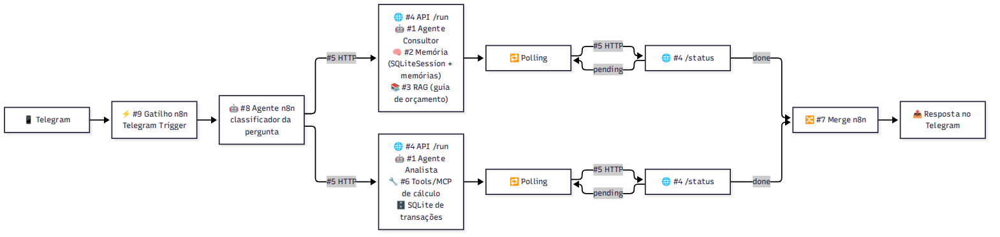

# TP2 — Entregáveis de arquitetura (Etapa 1.5)

**Aluno:** João Pedro Jacob · **Disciplina:** 26E3_5

Este documento responde aos seis entregáveis apresentados na Etapa 1.5 do Projeto de Bloco. Ele descreve a
**arquitetura-alvo** do agente de finanças pessoais, que será completada nas Etapas 3 (FastAPI), 4 (MCP) e 5
(n8n), e indica o que já está implementado no TP2.

## 1. Gatilho n8n

**Telegram** (`Telegram Trigger` do n8n).

- O uso típico é rápido e móvel: a pessoa quer saber, do celular, quanto gastou ou se está dentro do
  orçamento, em linguagem natural.
- O Telegram aceita o envio de arquivos no chat, então o próprio extrato CSV pode ser enviado como documento
  e encaminhado para o fluxo de importação.
- A conversa do Telegram tem um identificador estável (`chat_id`), que vira naturalmente o `session_id` do
  `SQLiteSession` — a mesma ideia do parâmetro `--sessao` do CLI atual.

## 2. Fontes de informação

| Tipo | Fonte | Conteúdo | Como é consultada |
| --- | --- | --- | --- |
| Estruturada | Banco SQLite `data/financas.db`, tabela `transacoes` | Transações dos extratos importados, já categorizadas | Tools de cálculo (`agent/tools.py`) |
| Não estruturada | Documento `knowledge/guia_orcamento.md` | Guia de orçamento pessoal: regra 50/30/20, faixas por categoria, sinais de alerta, metas | RAG com embeddings (`agent/rag.py`) |

Pergunta de dupla intenção que exige as duas fontes:

> *"Quanto gastei com Alimentação em abril e isso está dentro do recomendado?"*

A primeira parte é operacional (um número do banco); a segunda é conceitual (uma regra do guia).

## 3. Diagrama de arquitetura

Fonte do diagrama: `docs/tp2/arquitetura.mmd`.

## 4. Descrição textual da arquitetura

| # | Componente | Papel no agente de finanças | Estado no TP2 |
| --- | --- | --- | --- |
| 9 | Gatilho n8n (Telegram) | Recebe a mensagem ou o CSV enviado pelo usuário e inicia o fluxo | Documentado; Etapa 5 |
| 8 | Agente n8n (classificador) | Classifica a pergunta como conceitual (guia), operacional (dados) ou ambas, e decide quais agentes acionar | Documentado; Etapa 5 |
| 5 | Chamadas HTTP | Ligam o n8n à API dos agentes (`/run` para iniciar, `/status` para acompanhar) | Documentado; Etapas 3 e 5 |
| 4 | API `/run` e `/status` | Expõe cada agente Python como serviço assíncrono com polling | Documentado; Etapa 3 (FastAPI) |
| 1 | Agente Consultor | Responde dúvidas conceituais sobre orçamento usando o guia e as memórias do usuário | Implementado dentro do agente único do `perguntar` |
| 1 | Agente Analista | Responde perguntas sobre os gastos chamando as tools de cálculo sobre o SQLite | Implementado dentro do agente único do `perguntar` |
| 2 | Memória | Curto prazo: `SQLiteSession` por sessão. Longo prazo: tabela `memorias` com embeddings das interações | Implementado (`agent/consulta.py`, `agent/rag.py`) |
| 3 | RAG | Busca semântica por similaridade de cosseno sobre os trechos do guia e as memórias | Implementado (`agent/rag.py`, embeddings `gemini-embedding-001`) |
| 6 | Tools / MCP | Funções determinísticas de cálculo (totais, categorias, comparação, anomalias) | Implementado como `@function_tool`; vira servidor MCP na Etapa 4 |
| 7 | Merge n8n | Junta as respostas dos dois agentes quando a pergunta tem dupla intenção | Documentado; Etapa 5 |

No TP2 os dois papéis do componente #1 estão num único agente com todas as tools, porque ainda não existe o
roteador #8: o próprio agente decide se chama tools de cálculo, `buscar_conhecimento` ou ambos. A separação
em Consultor e Analista acontece quando o n8n assumir o roteamento.

## 5. Exemplo do fluxo de dados

Pergunta: *"Quanto gastei com Alimentação em abril e isso está dentro do recomendado?"* (dados do extrato
`samples/extrato_2_meses.csv`).

| Etapa / Ator | Componente | Ação e dado trafegado |
| --- | --- | --- |
| 1. Usuário | Telegram | Envia a pergunta no chat |
| 2. Gatilho | #9 Telegram Trigger | Entrega texto e `chat_id` ao fluxo |
| 3. Roteador | #8 Agente n8n | Detecta dupla intenção (operacional + conceitual) e aciona os dois agentes em paralelo |
| 4. Analista | #4 `/run` → #1 → #6 | Chama `gastos_por_categoria(mes="2024-04")` e obtém Alimentação = R$ 2.853,25 (3 transações, 63,41% da renda) |
| 5. Consultor | #4 `/run` → #1 → #3 / #2 | Busca "limite recomendado para alimentação" e recupera a seção *Alimentação* do guia: 10% a 15% da renda; verifica se há meta pessoal nas memórias |
| 6. Polling | #5 → #4 `/status` | O n8n consulta o status de cada execução até `done` |
| 7. Consolidação | #7 Merge | Junta: R$ 2.853,25 (63,41% da renda) contra a faixa de 10%–15% → acima do recomendado |
| 8. Resposta | Telegram | *"Em abril você gastou R$ 2.853,25 com Alimentação (63,41% da renda); o guia recomenda de 10% a 15%, então está acima do recomendado."* |

No TP2 os passos 4, 5 e 7 acontecem dentro de uma única execução do comando `perguntar`; o log
`prompts/outputs/perguntar_joao_20261002-181042.md` mostra exatamente essas duas chamadas de tool e a
resposta consolidada.

## 6. Dado estruturado

Tabela `transacoes` (SQLite):

| Campo | Tipo | Descrição |
| --- | --- | --- |
| `id` | INTEGER PK | Identificador da transação |
| `data` | TEXT | Data ISO `AAAA-MM-DD` |
| `descricao` | TEXT | Descrição original do extrato |
| `valor` | REAL | Valor absoluto em reais, sempre positivo |
| `tipo` | TEXT | `entrada` ou `saida` |
| `categoria` | TEXT NULL | Uma das 9 categorias fixas; nula até a classificação |
| `justificativa` | TEXT NULL | Raciocínio do classificador (chain-of-thought) |
| `arquivo_origem` | TEXT | CSV de onde a linha veio |
| `ocorrencia` | INTEGER | Ordem da repetição de uma linha idêntica no mesmo CSV |

Restrição `UNIQUE(data, descricao, valor, tipo, ocorrencia)`: reimportar um extrato não duplica linhas, e
duas compras idênticas legítimas no mesmo dia são preservadas.

Tabelas de apoio ao RAG e à memória, no mesmo arquivo:

| Tabela | Campos | Uso |
| --- | --- | --- |
| `trechos_guia` | `id`, `secao`, `texto`, `embedding` (JSON) | Trechos do guia indexados por seção |
| `memorias` | `id`, `sessao`, `criado_em`, `texto`, `embedding` (JSON) | Perguntas e respostas anteriores, recuperáveis em qualquer sessão |
| `metadados` | `chave`, `valor` | Hash do guia indexado (reindexa só quando o guia muda) |
| `agent_sessions`, `agent_messages` | criadas pelo `SQLiteSession` do SDK | Histórico de cada sessão |
